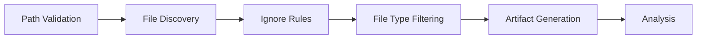

# Hybrid Code Analysis Tool

A comprehensive, offline-capable code analysis tool that combines traditional static analysis with LLM-powered reasoning, dynamic runtime analysis, and intelligent storage with semantic search capabilities.

## 🚀 Features

### Core Analysis Capabilities
- **Static Analysis**: SonarQube and Semgrep integration for precise bug detection
- **LLM-Powered Analysis**: CodeLlama integration for semantic understanding and explanations
- **Dynamic Runtime Analysis**: Execution tracing, memory profiling, and call graph generation
- **Multi-Codebase Comparison**: Architectural comparison and merge conflict prediction
- **Improvement Suggestions**: AI-generated refactoring and optimization recommendations

### Storage & Intelligence
- **SQLite Database**: Complete analysis history with metrics trending
- **Vector Embeddings**: Semantic search through past analyses using SentenceTransformers
- **Trend Analysis**: Code quality metrics tracking over time
- **Export Capabilities**: JSON export for external processing

### Deployment Options
- **Ollama Backend**: Easy local deployment for development
- **vLLM Backend**: High-performance production serving
- **Fully Offline**: No external API dependencies required

## 🛠 Installation

### Prerequisites
- Python 3.8+
- Ollama or vLLM with CodeLlama model
- SonarQube (optional, for enhanced static analysis)
- Semgrep CLI

### Quick Start
```bash
# Clone repository
git clone <repository-url>
cd hybrid-code-analyzer

# Install dependencies
pip install -r requirements.txt

# Install analysis tools
pip install semgrep
brew install sonar-scanner  # Or use your package manager

# Setup Ollama (if using Ollama backend)
curl -fsSL https://ollama.ai/install.sh | sh
ollama pull codellama:34b

# Or setup vLLM (if using vLLM backend)
pip install vllm
python -m vllm.entrypoints.openai.api_server \
    --model codellama/CodeLlama-34b-Instruct-hf \
    --served-model-name codellama-34b
```

## 📖 Usage

### Basic Code Analysis
```bash
# Analyze single codebase
python main.py --codebase /path/to/your/project

# Analyze with specific question
python main.py --codebase /path/to/project --question "Find security vulnerabilities"

# Save results to file
python main.py --codebase /path/to/project --output analysis.json
```

### Multi-Codebase Analysis
```bash
# Compare two codebases
python main.py --codebase-a /path/legacy --codebase-b /path/new --question "Compare architecture"

# Merge conflict analysis
python main.py --codebase-a /path/service1 --codebase-b /path/service2 --merge-analysis
```

### Advanced Features
```bash
# Use vLLM backend for better performance
python main.py --codebase /path/to/project --backend vllm

# Semantic search through past analyses
python search_similar.py --query "memory leak patterns" --codebase-filter /path/to/project

# Generate improvement suggestions
python suggest_improvements.py --codebase /path/to/project --output suggestions.md
```

## 🔍 File Discovery & Ignore Rules

The hybrid code analyzer now includes a robust file discovery system with comprehensive ignore rules support.

### File Discovery Features

- **Multiple Root Paths**: Analyze code across multiple directory trees
- **Ignore File Support**: Respect `.gitignore`, `.kilocodeignore`, and `.analyzerignore` files
- **File Type Filtering**: Automatic filtering of non-code files with 20+ supported extensions
- **Security Validation**: Directory traversal prevention and path scope validation
- **Comprehensive Reporting**: Detailed discovery artifacts and summaries

### Usage Examples

```bash
# Single codebase with discovery summary
python main.py --codebase ./my_project --discovery-summary

# Multiple root paths with JSON artifact output
python main.py --root-paths ./project1 ./project2 --discovery-output discovery.json

# Existing functionality preserved
python main.py --codebase ./my_project  # Works exactly as before
```

### Ignore File Support

The analyzer supports multiple ignore file types with proper precedence:

1. **`.gitignore`** (highest priority)
2. **`.kilocodeignore`** 
3. **`.analyzerignore`** (analyzer-specific, lowest priority)

#### Ignore File Patterns

Supports standard gitignore-style patterns:
- `*` - Matches any sequence of characters
- `?` - Matches single character
- `/` - Directory separator
- `**` - Recursive directory matching
- `#` - Comments

#### Example `.kilocodeignore` file:

```gitignore
# Ignore common non-code directories
node_modules/
venv/
.env/

# Ignore build artifacts
build/
dist/
*.egg-info/

# Ignore test files
test_*.py
*.test.py

# Ignore specific file types
*.log
*.tmp
*.bak
```

### File Type Filtering

The analyzer automatically filters non-code files using these extensions:

**Supported Code Extensions:**
`.py`, `.js`, `.ts`, `.java`, `.c`, `.cpp`, `.cs`, `.go`, `.rb`, `.php`, `.swift`, `.kt`, `.scala`, `.rs`, `.sh`, `.html`, `.css`, `.sql`, `.yaml`, `.yml`, `.json`, `.xml`

**Custom Extensions:**
Add custom extensions via configuration or command-line options.

### Discovery Reporting

#### Console Summary
```
============================================================
FILE DISCOVERY SUMMARY
============================================================
Files Discovered: 150
Files Ignored by Rules: 45
Files Ignored by Type: 20
Files Passed to Analysis: 85
Analysis Coverage: 56.67%
------------------------------------------------------------
Ignore Rules Applied: 2 sources
  Sources: .gitignore, .kilocodeignore
  Files Ignored: 45
File Type Filtering Applied
  Supported Extensions: 20
  Files Filtered: 20
============================================================
```

#### JSON Artifact

Complete discovery records are available in JSON format:

```bash
python main.py --codebase ./project --discovery-output discovery.json
```

The JSON artifact includes:
- Discovery metadata and timestamps
- Complete file discovery statistics
- Ignore rule application details
- File type filtering information
- Full file lists and categorization

### Advanced Features

#### Multiple Root Paths

Analyze code across multiple directory structures:

```bash
python main.py --root-paths ./frontend ./backend ./shared
```

#### Discovery Artifact Analysis

Use discovery artifacts for:
- Codebase documentation
- Build system optimization
- Test coverage planning
- Technical debt analysis

#### Integration with CI/CD

```yaml
# Example GitHub Actions workflow
- name: Code Analysis
  run: |
    python main.py --codebase . --discovery-output discovery.json
    # Use discovery.json for coverage planning, etc.
```

### Configuration

#### Custom File Extensions

Add custom extensions to the file type filter:

```python
from analyzer.file_type_filter import FileTypeFilter

filter = FileTypeFilter(custom_extensions=['.mydsl', '.custom'])
```

#### Ignore File Precedence

The analyzer respects this precedence order:
1. `.gitignore` (standard Git ignore patterns)
2. `.kilocodeignore` (project-specific patterns)
3. `.analyzerignore` (analyzer-specific patterns)

### Security Features

- **Directory Traversal Prevention**: Blocks attempts to escape root paths
- **Symlink Validation**: Ensures symlinks stay within allowed scope
- **Path Normalization**: Consistent handling across platforms
- **Input Validation**: Comprehensive error checking

### Performance

- **Efficient Discovery**: Optimized for large codebases
- **Caching**: Pattern compilation and rule caching
- **Parallel Processing**: Ready for multi-core optimization

### Backward Compatibility

All existing functionality is preserved:
- Single codebase analysis works unchanged
- Comparison and merge analysis unchanged
- All existing command-line options supported

### Technical Details

The file discovery system follows this pipeline:



Each stage produces detailed metrics and reporting data.

## 🏗 Architecture

### Core Modules
```
hybrid_analyzer/
├── analyzer/
│   ├── llm_client.py          # Ollama/vLLM client
│   ├── static_analyzer.py     # SonarQube, Semgrep integration
│   ├── dynamic_analyzer.py    # Runtime analysis, profiling
│   ├── multi_codebase.py      # Cross-codebase comparison
│   ├── improvement_suggester.py # AI-powered suggestions
│   └── analysis_storage.py    # SQLite + vector storage
├── tools/                     # External tool wrappers
└── config/                    # Configuration management
```

### Analysis Pipeline
1. **Static Analysis**: Traditional tools scan for bugs and code smells
2. **Dynamic Analysis**: Runtime profiling and execution tracing
3. **LLM Synthesis**: AI reasoning combines findings for insights
4. **Storage**: Results stored in SQLite with vector embeddings
5. **Suggestions**: AI generates actionable improvement recommendations

## 🔧 Configuration

### Environment Variables
```bash
export OLLAMA_BASE_URL="http://localhost:11434"
export VLLM_BASE_URL="http://localhost:8000"
export MODEL_NAME="codellama:34b"
export SEMGREP_PATH="semgrep"
export SONAR_SCANNER_PATH="sonar-scanner"
```

### Model Options
- **Recommended**: `codellama:34b` (best balance of performance and accuracy)
- **Lightweight**: `codellama:13b` (faster, less accurate)
- **Advanced**: `codellama:70b` (most accurate, requires more resources)

## 📊 Output Examples

### Analysis Report
```json
{
  "static_analysis": {
    "sonarqube": {"issues": [...], "metrics": {...}},
    "semgrep": {"results": [...], "errors": []},
    "summary": {"total_issues": 15, "quality_score": 85}
  },
  "dynamic_analysis": {
    "memory_profile": {...},
    "call_graph": {"most_complex": [...]},
    "execution_trace": {...}
  },
  "llm_analysis": "Comprehensive analysis of code quality issues...",
  "improvement_suggestions": {
    "architectural": ["Refactor module X for better separation..."],
    "performance": ["Optimize database queries in function Y..."],
    "security": ["Add input validation in endpoint Z..."],
    "priority_ranking": [...]
  }
}
```

### Storage Features
- **Trend Analysis**: Track code quality over time
- **Semantic Search**: "Find analyses similar to current performance issues"
- **Comparison History**: Review past multi-codebase analyses
- **Export Capabilities**: JSON export for CI/CD integration

## 🎯 Use Cases

### Development Teams
- **Code Review Assistance**: Pre-review analysis with improvement suggestions
- **Technical Debt Tracking**: Monitor code quality trends over time
- **Architecture Decisions**: Compare different implementation approaches

### DevOps & CI/CD
- **Quality Gates**: Automated code quality checks in pipelines
- **Merge Analysis**: Pre-merge compatibility checking
- **Technical Radar**: Track technology adoption and deprecation

### Security Teams
- **Vulnerability Detection**: Static + dynamic security analysis
- **Compliance Tracking**: Ensure coding standards adherence
- **Incident Analysis**: Historical analysis of security issues

## 🤝 Contributing

### Adding New Analysis Tools
1. Create wrapper in `tools/` directory
2. Integrate with `StaticAnalyzer` or `DynamicAnalyzer`
3. Update configuration and documentation

### Adding New LLM Capabilities
1. Extend `LLMClient` with new prompt templates
2. Add to appropriate analyzer module
3. Update main CLI interface

## 📄 License

MIT License - see LICENSE file for details.

## 🙏 Acknowledgments

- **CodeLlama** by Meta for code understanding capabilities
- **SonarQube** and **Semgrep** for static analysis foundation
- **Ollama** and **vLLM** for LLM serving infrastructure
- **SentenceTransformers** and **Chroma** for vector search capabilities

---

**Note**: This tool is designed for offline use and keeps all code analysis local to your infrastructure. No code or analysis results are sent to external services.

### Core Modules
```
hybrid_analyzer/
├── analyzer/
│   ├── llm_client.py          # Ollama/vLLM client
│   ├── static_analyzer.py     # SonarQube, Semgrep integration
│   ├── dynamic_analyzer.py    # Runtime analysis, profiling
│   ├── multi_codebase.py      # Cross-codebase comparison
│   ├── improvement_suggester.py # AI-powered suggestions
│   └── analysis_storage.py    # SQLite + vector storage
├── tools/                     # External tool wrappers
└── config/                    # Configuration management
```

### Analysis Pipeline
1. **Static Analysis**: Traditional tools scan for bugs and code smells
2. **Dynamic Analysis**: Runtime profiling and execution tracing
3. **LLM Synthesis**: AI reasoning combines findings for insights
4. **Storage**: Results stored in SQLite with vector embeddings
5. **Suggestions**: AI generates actionable improvement recommendations

## 🔧 Configuration

### Environment Variables
```bash
export OLLAMA_BASE_URL="http://localhost:11434"
export VLLM_BASE_URL="http://localhost:8000"
export MODEL_NAME="codellama:34b"
export SEMGREP_PATH="semgrep"
export SONAR_SCANNER_PATH="sonar-scanner"
```

### Model Options
- **Recommended**: `codellama:34b` (best balance of performance and accuracy)
- **Lightweight**: `codellama:13b` (faster, less accurate)
- **Advanced**: `codellama:70b` (most accurate, requires more resources)

## 📊 Output Examples

### Analysis Report
```json
{
  "static_analysis": {
    "sonarqube": {"issues": [...], "metrics": {...}},
    "semgrep": {"results": [...], "errors": []},
    "summary": {"total_issues": 15, "quality_score": 85}
  },
  "dynamic_analysis": {
    "memory_profile": {...},
    "call_graph": {"most_complex": [...]},
    "execution_trace": {...}
  },
  "llm_analysis": "Comprehensive analysis of code quality issues...",
  "improvement_suggestions": {
    "architectural": ["Refactor module X for better separation..."],
    "performance": ["Optimize database queries in function Y..."],
    "security": ["Add input validation in endpoint Z..."],
    "priority_ranking": [...]
  }
}
```

### Storage Features
- **Trend Analysis**: Track code quality over time
- **Semantic Search**: "Find analyses similar to current performance issues"
- **Comparison History**: Review past multi-codebase analyses
- **Export Capabilities**: JSON export for CI/CD integration

## 🎯 Use Cases

### Development Teams
- **Code Review Assistance**: Pre-review analysis with improvement suggestions
- **Technical Debt Tracking**: Monitor code quality trends over time
- **Architecture Decisions**: Compare different implementation approaches

### DevOps & CI/CD
- **Quality Gates**: Automated code quality checks in pipelines
- **Merge Analysis**: Pre-merge compatibility checking
- **Technical Radar**: Track technology adoption and deprecation

### Security Teams
- **Vulnerability Detection**: Static + dynamic security analysis
- **Compliance Tracking**: Ensure coding standards adherence
- **Incident Analysis**: Historical analysis of security issues

## 🤝 Contributing

### Adding New Analysis Tools
1. Create wrapper in `tools/` directory
2. Integrate with `StaticAnalyzer` or `DynamicAnalyzer`
3. Update configuration and documentation

### Adding New LLM Capabilities
1. Extend `LLMClient` with new prompt templates
2. Add to appropriate analyzer module
3. Update main CLI interface

## 📄 License

MIT License - see LICENSE file for details.

## 🙏 Acknowledgments

- **CodeLlama** by Meta for code understanding capabilities
- **SonarQube** and **Semgrep** for static analysis foundation
- **Ollama** and **vLLM** for LLM serving infrastructure
- **SentenceTransformers** and **Chroma** for vector search capabilities

---

**Note**: This tool is designed for offline use and keeps all code analysis local to your infrastructure. No code or analysis results are sent to external services.