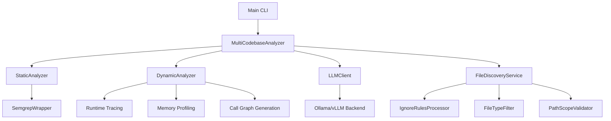

## Hybrid Code Analysis Tool - Project Summary

### 🎯 Project Overview
This is a comprehensive, offline-capable code analysis tool that combines traditional static analysis with LLM-powered reasoning, dynamic runtime analysis, and intelligent storage with semantic search capabilities.

### 🏗 Core Architecture



### 🔧 Key Components

#### 1. **File Discovery System**
- **Multiple Root Paths**: Supports analyzing code across multiple directory trees
- **Ignore File Support**: Respects `.gitignore`, `.kilocodeignore`, and `.analyzerignore` files with proper precedence
- **File Type Filtering**: Automatic filtering of non-code files with 20+ supported extensions
- **Security Validation**: Directory traversal prevention and path scope validation
- **Comprehensive Reporting**: Detailed discovery artifacts and summaries

#### 2. **Static Analysis**
- **Semgrep Integration**: Primary static analysis tool for bug detection
- **Custom Analysis**: File size analysis, complexity detection, and coverage tracking
- **Execution Failure Tracking**: Structured error handling with failure classification
- **Coverage Metrics**: Detailed analysis completeness reporting

#### 3. **Dynamic Analysis**
- **Runtime Tracing**: Execution path tracking using Python's trace module
- **Memory Profiling**: Memory usage analysis with memory_profiler
- **Call Graph Generation**: Function call analysis using PyCG
- **Data Flow Analysis**: Dynamic execution with various test inputs
- **Method Coverage Tracking**: Comprehensive execution coverage metrics

#### 4. **LLM-Powered Analysis**
- **CodeLlama Integration**: Semantic understanding and explanations
- **Ollama/vLLM Backends**: Local deployment options for offline use
- **Question-Based Analysis**: Custom analysis based on user questions
- **Multi-Codebase Comparison**: Architectural analysis and merge conflict prediction

#### 5. **Storage & Intelligence**
- **SQLite Database**: Complete analysis history with metrics trending
- **Vector Embeddings**: Semantic search through past analyses
- **Trend Analysis**: Code quality metrics tracking over time
- **Export Capabilities**: JSON export for external processing

### 📊 Key Features

#### **Completeness & Confidence Reporting**
- **Coverage-Based Metrics**: Uses actual coverage percentages instead of naive confidence ratios
- **Failure Context**: Meaningful interpretation of execution failures
- **Analysis Completeness**: Tracks files discovered, analyzed, and skipped
- **Execution Coverage**: Method-level tracking of analysis success rates

#### **Execution Failure Tracking**
- **Structured Failure Classification**: Types (FILE_ACCESS_ERROR, TOOL_ERROR, etc.)
- **Severity Levels**: INFO, WARNING, ERROR, CRITICAL
- **Analysis Findings vs Errors**: Distinguishes between valid findings and actual errors
- **Comprehensive Context**: Raw errors, tracebacks, timestamps, and execution logs

#### **Ignore Rule Precedence**
1. **`.analyzerignore`** (highest priority - analyzer-specific)
2. **`.gitignore`** (standard Git patterns)
3. **`.kilocodeignore`** (project-specific)
4. **Default rules** from configuration (fallback)

### 🎯 Use Cases

#### **Development Teams**
- Code review assistance with improvement suggestions
- Technical debt tracking and monitoring
- Architecture decisions and comparison

#### **DevOps & CI/CD**
- Quality gates with automated code quality checks
- Merge analysis for pre-merge compatibility
- Technical radar for technology adoption

#### **Security Teams**
- Vulnerability detection with static + dynamic analysis
- Compliance tracking for coding standards
- Incident analysis with historical data

### 🔍 Technical Highlights

1. **Offline-First Design**: No external API dependencies required
2. **Comprehensive Error Handling**: Graceful degradation with detailed failure reporting
3. **Extensible Architecture**: Easy to add new analysis tools and LLM capabilities
4. **Performance Optimized**: Caching, parallel processing ready, efficient discovery
5. **Backward Compatible**: All existing functionality preserved

### 📁 Project Structure

```
hybrid_code_analyser/
├── analyzer/                  # Core analysis modules
│   ├── llm_client.py          # Ollama/vLLM client
│   ├── static_analyzer.py     # Semgrep integration
│   ├── dynamic_analyzer.py    # Runtime analysis
│   ├── multi_codebase.py      # Cross-codebase comparison
│   ├── file_discovery.py      # File discovery system
│   ├── ignore_rules.py        # Ignore rule processing
│   └── analysis_storage.py    # SQLite + vector storage
├── tools/                     # External tool wrappers
├── config/                    # Configuration management
├── test_framework/           # Testing infrastructure
└── main.py                    # CLI entry point
```

### 🚀 Deployment Options

- **Ollama Backend**: Easy local deployment for development
- **vLLM Backend**: High-performance production serving
- **Model Options**: CodeLlama 13B, 34B, or 70B based on resource requirements

### 📊 Output & Reporting

- **JSON Reports**: Comprehensive analysis results with all metrics
- **Console Summaries**: Human-readable discovery and analysis summaries
- **Database Storage**: Historical tracking and trend analysis
- **Semantic Search**: Find similar analyses using vector embeddings

This project represents a sophisticated hybrid approach to code analysis, combining the precision of traditional tools with the semantic understanding of LLMs, all while maintaining robust error handling, comprehensive reporting, and offline capability.