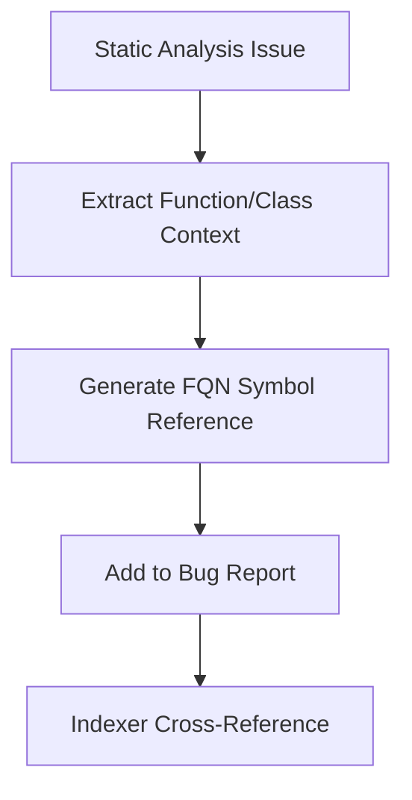
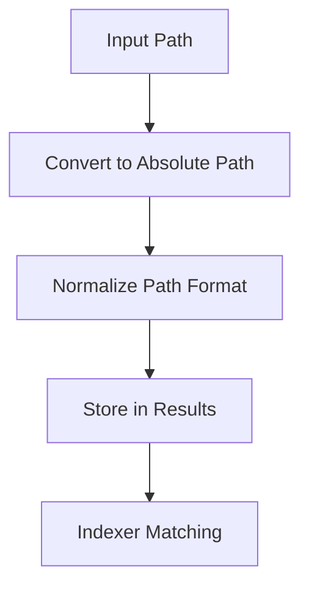
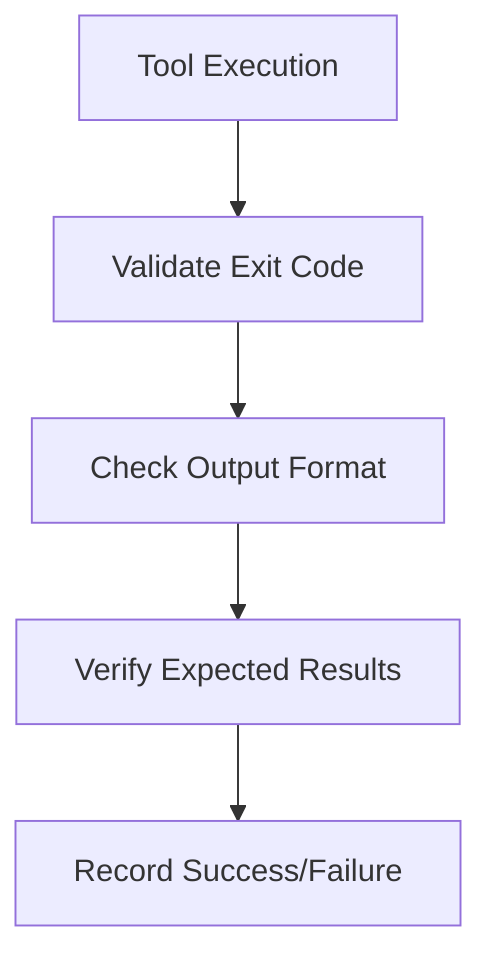

# Hybrid Code Analyzer - Pre-Integration Gap Analysis

## Executive Summary

This document presents a comprehensive gap analysis of the Hybrid Code Analyzer tool in preparation for integration with the codebase indexer tool. The analysis identifies critical gaps, risks, and missing functionality that could prevent successful integration or cause silent failures during agent usage.

## Analysis Methodology

The analysis examined the following key areas:

1. **Integration Readiness** - Bug report structure, path consistency, symbol mapping
2. **CLI Robustness** - External invocation, error handling, query capabilities
3. **Access Layer** - Result limiting, bounded views, raw JSON exposure
4. **Silent Failure Detection** - Tool failure vs clean code distinction
5. **Change Detection** - Incremental analysis, file change handling
6. **Symbol Extraction** - Function/class mapping, FQN compatibility
7. **Multi-Codebase Analysis** - Separate analysis, conflict detection
8. **Missing Functionality** - Agent requirements, impact analysis
9. **Observability & Debugging** - Analysis tracing, coverage reporting

## Critical Gaps (Must-fix before integration)

### 1. Integration Readiness Issues

#### Missing Symbol-Level Mapping
**Issue**: Bug reports include file paths and line numbers but lack comprehensive symbol mapping (functions, classes, methods)
**Location**: [`analyzer_cli/output_formatter.py`](analyzer_cli/output_formatter.py:19-58) - Static analysis results only include basic location data
**Impact**: Indexer cannot cross-reference bugs with specific symbols/functions
**Risk Level**: CRITICAL - Will prevent effective integration

#### Inconsistent Path Handling
**Issue**: File paths are sometimes relative, sometimes absolute depending on input
**Location**: [`analyzer_cli/input_handler.py`](analyzer_cli/input_handler.py:66-102) - No path normalization
**Impact**: Indexer may fail to match analyzer results with indexed files
**Risk Level**: CRITICAL - Will cause matching failures

#### Missing Severity Standardization
**Issue**: Severity levels are inconsistently applied across different analysis types
**Location**: [`analyzer/static_analyzer.py`](analyzer/static_analyzer.py:214) vs [`analyzer/dynamic_analyzer.py`](analyzer/dynamic_analyzer.py:100-150)
**Impact**: Agents cannot reliably query by severity
**Risk Level**: HIGH - Will impact agent decision making

### 2. CLI Robustness Problems

#### Limited Query Capabilities
**Issue**: CLI doesn't support agent-friendly queries like "all critical bugs" or "bugs in file X"
**Location**: [`analyzer_cli/cli_wrapper.py`](analyzer_cli/cli_wrapper.py:56-132) - Only basic argument parsing
**Impact**: Agents must parse full JSON output to filter results
**Risk Level**: HIGH - Inefficient agent operations

#### No Incremental Analysis CLI Support
**Issue**: Incremental analysis exists but lacks proper CLI integration
**Location**: [`analyzer_cli/incremental.py`](analyzer_cli/incremental.py:231-240) - Logic exists but not exposed via CLI
**Impact**: Agents cannot efficiently analyze only changed files
**Risk Level**: HIGH - Performance impact for large codebases

### 3. Silent Failure Detection Risks

#### Indistinguishable Failure Modes
**Issue**: "No bugs found" could mean clean code OR silent tool failures
**Location**: [`analyzer_cli/error_handler.py`](analyzer_cli/error_handler.py:101-137) - No validation that analysis actually completed
**Impact**: Agents may miss critical bugs due to silent failures
**Risk Level**: CRITICAL - Could lead to false confidence in clean code

#### Missing Tool Health Checks
**Issue**: No validation that Semgrep/Scalene/VizTracer actually executed successfully
**Location**: [`analyzer/static_analyzer.py`](analyzer/static_analyzer.py:205) and [`analyzer/dynamic_analyzer.py`](analyzer/dynamic_analyzer.py:100)
**Impact**: Silent failures go undetected
**Risk Level**: CRITICAL - Analysis reliability at risk

## High-Priority Gaps (Should-fix for reliable operation)

### 4. Symbol Extraction Limitations

#### Incomplete Symbol Capture
**Issue**: Dynamic analyzer captures function names but lacks class/method context
**Location**: [`analyzer/dynamic_analyzer.py`](analyzer/dynamic_analyzer.py:315-325) - Only function names, no FQN support
**Impact**: Cannot map bugs to indexer's FQN format
**Risk Level**: HIGH - Integration compatibility issue

#### Missing Symbol Cross-Referencing
**Issue**: No way to link static analysis issues to specific functions/classes
**Location**: [`analyzer_cli/output_formatter.py`](analyzer_cli/output_formatter.py:28-40) - Issues lack symbol references
**Impact**: Agents cannot determine which symbols are affected by bugs
**Risk Level**: HIGH - Limits agent effectiveness

### 5. Multi-Codebase Analysis Gaps

#### No Codebase Labeling
**Issue**: Multi-codebase results don't clearly indicate source codebase
**Location**: [`analyzer/multi_codebase.py`](analyzer/multi_codebase.py:131-207) - No codebase labeling in output
**Impact**: Agents cannot distinguish which codebase issues came from
**Risk Level**: MEDIUM - Could cause confusion in merge scenarios

#### Missing Conflict Detection
**Issue**: No automated detection of conflicts or duplicated functionality
**Location**: [`analyzer/multi_codebase.py`](analyzer/multi_codebase.py:131-207) - Only basic comparison
**Impact**: Agents cannot identify merge conflicts
**Risk Level**: MEDIUM - Limits merge assistance capabilities

### 6. Observability & Debugging Gaps

#### Limited Analysis Tracing
**Issue**: Cannot trace which analysis methods ran on which files
**Location**: [`analyzer/dynamic_analyzer.py`](analyzer/dynamic_analyzer.py:169-190) - Coverage tracking exists but not exposed
**Impact**: Agents cannot determine analysis completeness
**Risk Level**: MEDIUM - Reduces debugging capability

#### Missing Partial Failure Logging
**Issue**: If profiling fails on some files, this isn't clearly logged
**Location**: [`analyzer/dynamic_analyzer.py`](analyzer/dynamic_analyzer.py:156-167) - File-level errors buried in results
**Impact**: Agents cannot identify which files failed analysis
**Risk Level**: MEDIUM - Limits error visibility

## Nice-to-Haves (Would improve usability)

### 7. Enhanced Query Capabilities

#### Missing Impact Analysis
**Issue**: Cannot query "impact of fixing bug X" using indexer dependencies
**Location**: No integration points with indexer for dependency analysis
**Impact**: Agents cannot prioritize fixes based on impact
**Risk Level**: LOW - Would enhance agent capabilities

#### Limited Metadata Exposure
**Issue**: Not all metadata needed for prioritization is exposed
**Location**: [`analyzer_cli/output_formatter.py`](analyzer_cli/output_formatter.py:124-173) - Summary lacks some prioritization data
**Impact**: Agents have limited information for bug prioritization
**Risk Level**: LOW - Would improve decision making

### 8. Access Layer Improvements

#### Direct JSON Access
**Issue**: Analyzer exposes full JSON output without access layer
**Location**: [`analyzer_cli/output_formatter.py`](analyzer_cli/output_formatter.py:262-270) - Full output written to file
**Impact**: Agents must handle large JSON files directly
**Risk Level**: LOW - Could impact performance

#### Missing Bounded Views
**Issue**: No support for "top-N bugs" or "specific severity only" queries
**Location**: [`analyzer_cli/guardrails.py`](analyzer_cli/guardrails.py:169-198) - Only size-based limiting
**Impact**: Agents must filter results manually
**Risk Level**: LOW - Would improve efficiency

## Integration Risk Assessment

### Critical Integration Risks

1. **Symbol Mapping Failure**: Without proper symbol-level mapping, the indexer cannot cross-reference analyzer findings with codebase symbols
2. **Path Mismatch Issues**: Inconsistent path handling may prevent the indexer from matching analyzer results to indexed files
3. **Silent Failure Modes**: Undetected tool failures could lead to false "clean code" reports
4. **Query Limitations**: Lack of agent-friendly queries will force inefficient JSON parsing

### Mitigation Strategy

**Phase 1: Critical Fixes (Before Integration)**
- Implement symbol-level mapping with FQN support
- Standardize path handling to absolute format
- Add tool health checks and failure validation
- Enhance CLI with basic query capabilities

**Phase 2: High-Priority Enhancements (Post-Integration)**
- Improve symbol extraction completeness
- Add multi-codebase labeling
- Enhance observability and debugging
- Implement incremental analysis CLI support

**Phase 3: Nice-to-Have Improvements (Future)**
- Add impact analysis capabilities
- Implement access layer with bounded views
- Enhance metadata exposure for prioritization

## Technical Recommendations

### Symbol Mapping Implementation

### Path Standardization Approach

### Tool Health Check Implementation

## Conclusion

The Hybrid Code Analyzer has strong foundations but requires critical enhancements to ensure reliable integration with the codebase indexer tool. The identified gaps primarily revolve around:

1. **Symbol-level mapping** for effective cross-referencing
2. **Consistent path handling** for reliable file matching
3. **Tool health validation** to prevent silent failures
4. **Agent-friendly query support** for efficient operations

Addressing these critical gaps will significantly reduce integration risks and ensure the analyzer can effectively support AI coding agents in finding and fixing bugs with bounded context.

## Appendix: File References

Key files requiring modifications:
- [`analyzer_cli/output_formatter.py`](analyzer_cli/output_formatter.py) - Symbol mapping enhancement
- [`analyzer_cli/input_handler.py`](analyzer_cli/input_handler.py) - Path normalization
- [`analyzer_cli/error_handler.py`](analyzer_cli/error_handler.py) - Tool health checks
- [`analyzer_cli/cli_wrapper.py`](analyzer_cli/cli_wrapper.py) - Query capability enhancement
- [`analyzer/multi_codebase.py`](analyzer/multi_codebase.py) - Codebase labeling
- [`analyzer/dynamic_analyzer.py`](analyzer/dynamic_analyzer.py) - Symbol extraction improvement