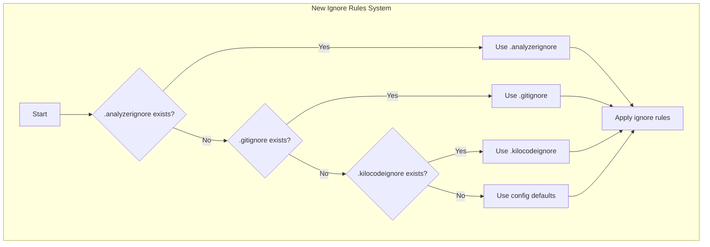

# .analyzerignore Support Architecture

## Overview

This document outlines the architectural design for adding `.analyzerignore` file support with new precedence logic and fallback to configuration file. The solution modifies the existing ignore rules system to prioritize `.analyzerignore` files and provide sensible defaults when no ignore files exist.

## Core Requirements

### New Precedence Logic

The system must implement the following precedence order:

1. **First**: Check for `.analyzerignore` file
2. **Second**: If not found, look for `.gitignore` file
3. **Third**: If not found, look for `.kilocodeignore` file  
4. **Fourth**: If none exist, use basic rules from configuration file

### Constraints

- **No new heavy dependencies**: Use existing infrastructure
- **Deterministic behavior**: Consistent results regardless of environment
- **Debuggable**: Clear logging and reporting of ignore decisions

## Current Architecture Analysis

### Existing Ignore Rules System

The current `IgnoreRulesProcessor` in `analyzer/ignore_rules.py` implements:

```python
def load_ignore_rules(self, root_path: str, analyzer_type: str = None) -> List[IgnoreRule]:
    rules = []
    
    # 1. Load .gitignore (highest priority)
    gitignore_path = os.path.join(root_path, '.gitignore')
    if os.path.exists(gitignore_path):
        gitignore_rules = self._parse_gitignore_file(gitignore_path, '.gitignore')
        rules.extend(gitignore_rules)
    
    # 2. Load .kilocodeignore
    kiloignore_path = os.path.join(root_path, '.kilocodeignore')
    if os.path.exists(kiloignore_path):
        kiloignore_rules = self._parse_gitignore_file(kiloignore_path, '.kilocodeignore')
        rules.extend(kiloignore_rules)
    
    # 3. Load analyzer-specific ignore file (lowest priority)
    if analyzer_type:
        analyzer_ignore = os.path.join(root_path, f'.{analyzer_type}ignore')
        if os.path.exists(analyzer_ignore):
            analyzer_rules = self._parse_gitignore_file(analyzer_ignore, f'.{analyzer_type}ignore')
            rules.extend(analyzer_rules)
    
    return rules
```

### Issues with Current Approach

1. **Wrong precedence**: `.gitignore` has highest priority instead of `.analyzerignore`
2. **No fallback**: When no ignore files exist, system defaults to "ignore nothing"
3. **No configuration**: No way to specify basic default ignore rules

## Proposed Architecture

### High-Level Design



### Component Changes Required

#### 1. Configuration File (`config/ignore_rules_config.py`)

**New File**: `config/ignore_rules_config.py`

```python
# Default ignore rules when no ignore files exist
DEFAULT_IGNORE_RULES = [
    # Common non-code directories
    "node_modules/",
    "venv/",
    ".venv/",
    "env/",
    ".env/",
    "__pycache__/",
    ".pyc",
    
    # Build artifacts
    "build/",
    "dist/",
    "*.egg-info/",
    ".egg-info/",
    
    # Test files
    "test_*.py",
    "*.test.py",
    "tests/",
    
    # Common non-code files
    "*.log",
    "*.tmp",
    "*.bak",
    "*.swp",
    
    # IDE-specific files
    ".idea/",
    ".vscode/",
    "*.iml",
    
    # Documentation
    "docs/",
    "*.md",
    "*.rst",
    
    # Configuration files
    "*.ini",
    "*.cfg",
    "*.conf",
    
    # Database files
    "*.db",
    "*.sqlite",
    "*.sqlite3",
    
    # Virtual environment markers
    "pyvenv.cfg",
    ".python-version",
]

def get_default_ignore_rules() -> List[str]:
    """
    Get default ignore rules from configuration
    
    Returns:
        List of default ignore patterns
    """
    return DEFAULT_IGNORE_RULES.copy()
```

#### 2. Updated IgnoreRulesProcessor

**Modified File**: `analyzer/ignore_rules.py`

```python
from config.ignore_rules_config import get_default_ignore_rules

class IgnoreRulesProcessor:
    def __init__(self):
        """Initialize the ignore rules processor"""
        self.pattern_cache = {}
        self.rule_cache = {}
        self.default_rules = get_default_ignore_rules()  # Load default rules
        
    def load_ignore_rules(self, root_path: str, analyzer_type: str = None) -> List[IgnoreRule]:
        """
        Load and merge ignore rules with new precedence logic
        
        NEW PRECEDENCE ORDER:
        1. .analyzerignore (highest priority)
        2. .gitignore
        3. .kilocodeignore
        4. Default rules from config (fallback)
        
        Args:
            root_path: Root directory to search for ignore files
            analyzer_type: Optional analyzer type (not used in new logic)
            
        Returns:
            List of IgnoreRule objects in precedence order
        """
        rules = []
        
        # NEW LOGIC: Check .analyzerignore FIRST (highest priority)
        analyzerignore_path = os.path.join(root_path, '.analyzerignore')
        if os.path.exists(analyzerignore_path):
            logger.info(f"Using .analyzerignore rules from {analyzerignore_path}")
            analyzerignore_rules = self._parse_gitignore_file(analyzerignore_path, '.analyzerignore')
            rules.extend(analyzerignore_rules)
            return rules  # Return immediately - .analyzerignore takes full precedence
        
        # SECOND: Check .gitignore
        gitignore_path = os.path.join(root_path, '.gitignore')
        if os.path.exists(gitignore_path):
            logger.info(f"Using .gitignore rules from {gitignore_path}")
            gitignore_rules = self._parse_gitignore_file(gitignore_path, '.gitignore')
            rules.extend(gitignore_rules)
            return rules
        
        # THIRD: Check .kilocodeignore
        kiloignore_path = os.path.join(root_path, '.kilocodeignore')
        if os.path.exists(kiloignore_path):
            logger.info(f"Using .kilocodeignore rules from {kiloignore_path}")
            kiloignore_rules = self._parse_gitignore_file(kiloignore_path, '.kilocodeignore')
            rules.extend(kiloignore_rules)
            return rules
        
        # FOURTH: Use default rules from configuration
        logger.info("No ignore files found, using default ignore rules")
        default_rules = []
        for pattern in self.default_rules:
            rule = IgnoreRule(pattern=pattern, source='default_config', line_number=0)
            default_rules.append(rule)
        
        return default_rules
```

#### 3. Enhanced IgnoreReport for Better Tracking

**Modified File**: `analyzer/ignore_rules.py`

```python
class IgnoreReport:
    def __init__(self):
        self.ignored_files = []
        self.ignore_sources = set()
        self.patterns_applied = set()
        self.rules_source = None  # Track which source was used
        self.fallback_used = False  # Track if fallback was used
        
    def set_rules_source(self, source: str, is_fallback: bool = False):
        """Set the source of ignore rules"""
        self.rules_source = source
        self.fallback_used = is_fallback
        
    def add_ignored_file(self, file_path: str, reason: str):
        """Add a file to the ignore report with reason"""
        self.ignored_files.append({'file': file_path, 'reason': reason})
        
        # Extract source and pattern from reason
        if '[' in reason and ']' in reason:
            source = reason.split('[')[1].split(']')[0]
            self.ignore_sources.add(source)
            pattern = reason.split('pattern:')[1].strip() if 'pattern:' in reason else 'unknown'
            self.patterns_applied.add(pattern)
        
    def to_dict(self) -> Dict[str, Any]:
        """Convert ignore report to dictionary"""
        return {
            'total_files_ignored': len(self.ignored_files),
            'ignore_sources': list(self.ignore_sources),
            'patterns_applied': list(self.patterns_applied),
            'rules_source': self.rules_source,
            'fallback_used': self.fallback_used,
            'ignored_files': self.ignored_files
        }
```

#### 4. Example .analyzerignore File

**New File**: `.analyzerignore` (example)

```gitignore
# Hybrid Code Analyzer - Default Ignore Rules
# This file defines what files/directories should be ignored during code analysis

# Common non-code directories
node_modules/
venv/
.env/
__pycache__/

# Build artifacts
build/
dist/
*.egg-info/

# Test files and directories
test_*.py
*.test.py
tests/

# Common non-code file types
*.log
*.tmp
*.bak
*.swp

# IDE-specific files and directories
.idea/
.vscode/
*.iml

# Documentation files
*.md
*.rst

# Configuration files
*.ini
*.cfg
*.conf

# Database files
data/
*.db
*.sqlite
*.sqlite3

# Virtual environment files
pyvenv.cfg
.python-version

# Project-specific ignores for code analysis
# These are files that typically don't need static/dynamic analysis

# Ignore large generated files
migrations/

# Ignore API documentation
api_docs/

# Ignore example/test data
example_data/
sample_data/

# Ignore local development configurations
local_config.json
.development.env

# Ignore any cache directories
.cache/

# Ignore any temporary directories
temp/
tmp/

# Ignore any backup files
*~
*.bak

# Ignore any minified files
*.min.js
*.min.css

# Ignore any bundle files
bundle.js
bundle.css

# Ignore any coverage files
coverage/
.coverage

# Ignore any log directories
logs/

# Ignore any build tool outputs
webpack.config.js
package-lock.json
yarn.lock
```

## Implementation Plan

### Step-by-Step Implementation

#### Step 1: Create Configuration File

```python
# Create config/ignore_rules_config.py
from typing import List

# Default ignore rules when no ignore files exist
DEFAULT_IGNORE_RULES = [
    # Common non-code directories
    "node_modules/", "venv/", ".venv/", "env/", ".env/", "__pycache__/", ".pyc",
    # Build artifacts
    "build/", "dist/", "*.egg-info/", ".egg-info/",
    # Test files
    "test_*.py", "*.test.py", "tests/",
    # Common non-code files
    "*.log", "*.tmp", "*.bak", "*.swp",
    # IDE-specific files
    ".idea/", ".vscode/", "*.iml",
    # Documentation
    "docs/", "*.md", "*.rst",
    # Configuration files
    "*.ini", "*.cfg", "*.conf",
    # Database files
    "*.db", "*.sqlite", "*.sqlite3",
    # Virtual environment markers
    "pyvenv.cfg", ".python-version",
]

def get_default_ignore_rules() -> List[str]:
    """Get default ignore rules from configuration"""
    return DEFAULT_IGNORE_RULES.copy()
```

#### Step 2: Update IgnoreRulesProcessor

```python
# In analyzer/ignore_rules.py

# Add import at top
from config.ignore_rules_config import get_default_ignore_rules

# Update __init__ method
self.default_rules = get_default_ignore_rules()

# Replace load_ignore_rules method with new precedence logic
```

#### Step 3: Enhance IgnoreReport

```python
# Update IgnoreReport class in analyzer/ignore_rules.py
# Add rules_source and fallback_used tracking
```

#### Step 4: Update FileDiscoveryService

```python
# In analyzer/file_discovery.py
# Update _apply_ignore_rules to track rules source

def _apply_ignore_rules(self, files: List[str], root_paths: List[str], analyzer_type: str = None):
    # Load ignore rules from all root paths
    all_ignore_rules = []
    ignore_report = IgnoreReport()
    
    for root_path in root_paths:
        rules = self.ignore_processor.load_ignore_rules(root_path, analyzer_type)
        
        # Track which source was used
        if rules:
            source = "unknown"
            if rules[0].source == '.analyzerignore':
                source = '.analyzerignore'
            elif rules[0].source == '.gitignore':
                source = '.gitignore'
            elif rules[0].source == '.kilocodeignore':
                source = '.kilocodeignore'
            elif rules[0].source == 'default_config':
                source = 'default_config'
                ignore_report.set_rules_source(source, is_fallback=True)
            else:
                source = rules[0].source
            
            ignore_report.set_rules_source(source, is_fallback=(source == 'default_config'))
        
        all_ignore_rules.extend(rules)
    
    # Rest of method remains the same
```

#### Step 5: Update Discovery Artifact Generation

```python
# In analyzer/discovery_artifact.py
# Enhance artifact generation to include ignore source information

def _generate_ignore_section(self, ignore_report: IgnoreReport) -> Dict[str, Any]:
    if not ignore_report:
        return {
            'rules_applied': False,
            'files_ignored': 0,
            'sources': []
        }
    
    section = {
        'rules_applied': True,
        'files_ignored': ignore_report.total_files_ignored,
        'sources': list(ignore_report.ignore_sources),
        'patterns_used': list(ignore_report.patterns_applied),
        'ignored_files_count': len(ignore_report.ignored_files),
        'rules_source': ignore_report.rules_source,
        'fallback_used': ignore_report.fallback_used,
        'ignored_files_sample': ignore_report.ignored_files[:10] if ignore_report.ignored_files else []
    }
    
    return section
```

### Testing Strategy

#### Unit Tests
- Test precedence logic with different file combinations
- Test fallback to default rules
- Test configuration loading
- Test ignore report tracking

#### Integration Tests
- Test full discovery pipeline with new precedence
- Test artifact generation with source tracking
- Test error handling scenarios

#### End-to-End Tests
- Test complete analysis workflow
- Validate discovery artifacts
- Test performance with large codebases

### Backward Compatibility

**Breaking Changes:**
- **Precedence order changed**: `.analyzerignore` now has highest priority instead of `.gitignore`
- **Fallback behavior changed**: System now uses default rules instead of "ignore nothing"

**Migration Path:**
1. **Existing projects**: Continue working as before (files will be found in new precedence order)
2. **New projects**: Can use `.analyzerignore` for analyzer-specific rules
3. **Configuration**: Default rules can be customized in `config/ignore_rules_config.py`

### Expected Outcomes

1. **Better Default Behavior**: Sensible defaults when no ignore files exist
2. **Analyzer-Specific Control**: `.analyzerignore` allows precise control over analysis scope
3. **Improved Debugging**: Clear tracking of which ignore rules source was used
4. **Consistent Results**: Deterministic behavior across different environments
5. **Enhanced Reporting**: Better visibility into ignore decisions

### Validation Criteria

- ✅ `.analyzerignore` takes precedence when present
- ✅ Falls back to `.gitignore` when `.analyzerignore` not found
- ✅ Falls back to `.kilocodeignore` when neither `.analyzerignore` nor `.gitignore` found
- ✅ Uses default rules when no ignore files exist
- ✅ Proper logging of ignore source decisions
- ✅ Enhanced reporting with source tracking
- ✅ No new dependencies introduced
- ✅ Deterministic behavior maintained

### Delegation to Orchestrator Agent

The following concrete implementation tasks should be delegated:

1. **Create Configuration File:**
   - Create `config/ignore_rules_config.py` with default ignore rules
   - Define comprehensive default patterns
   - Add proper documentation

2. **Update IgnoreRulesProcessor:**
   - Implement new precedence logic
   - Add default rules fallback
   - Update logging for better debugging
   - Test all precedence scenarios

3. **Enhance IgnoreReport:**
   - Add rules source tracking
   - Add fallback usage tracking
   - Update to_dict() method
   - Test reporting functionality

4. **Update FileDiscoveryService:**
   - Track ignore rules source
   - Update artifact generation
   - Test integration

5. **Update DiscoveryArtifactGenerator:**
   - Enhance ignore section generation
   - Add source information to artifacts
   - Test artifact generation

6. **Create Example .analyzerignore:**
   - Create comprehensive example file
   - Add documentation comments
   - Include common patterns

7. **Update Documentation:**
   - Update README.md with new precedence
   - Add configuration documentation
   - Update usage examples
   - Add migration guide

8. **Add Tests:**
   - Unit tests for new functionality
   - Integration tests for full pipeline
   - End-to-end tests for complete workflow
   - Performance tests

This architectural plan provides a clear roadmap for implementing the new `.analyzerignore` support with proper precedence logic and fallback to configuration, while maintaining all existing functionality and constraints.