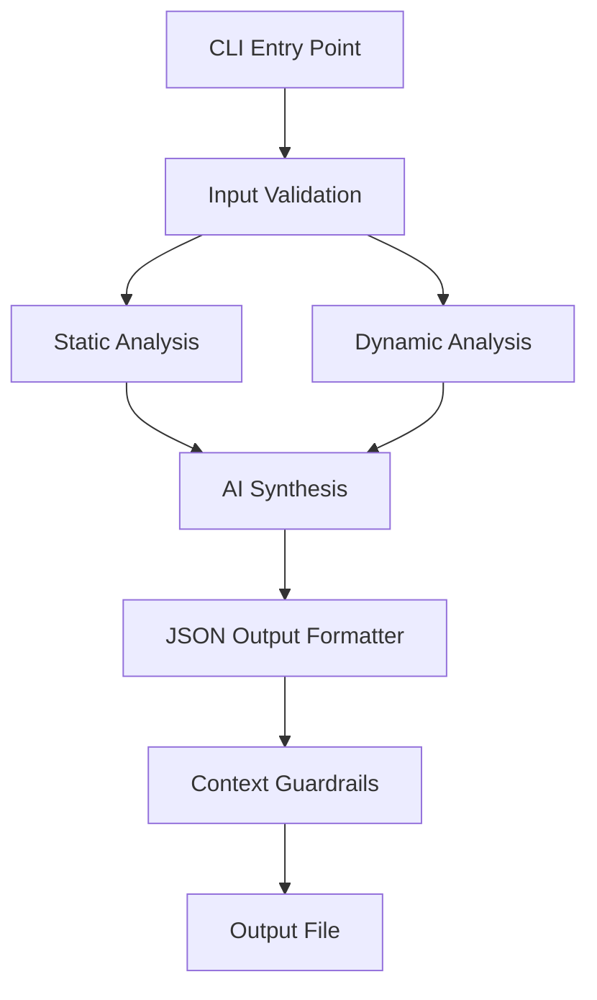

# CLI Implementation Plan for Hybrid Code Analyzer

## Overview
The CLI will be a wrapper around the existing analyzer modules, providing a structured JSON interface for autonomous agents while preserving all original functionality.

## Architecture



## Implementation Steps

### 1. Directory Structure
```
analyzer_cli/
├── __init__.py
├── main.py               # CLI entry point
├── cli_wrapper.py        # Core CLI logic
├── input_handler.py      # Input validation and processing
├── output_formatter.py   # JSON output formatting
├── error_handler.py      # Error handling and safety
├── incremental.py        # Incremental analysis support
├── guardrails.py         # Context size management
└── utils.py              # Utility functions
```

### 2. Core Components

#### CLI Wrapper (`cli_wrapper.py`)
- Orchestrates the analysis workflow
- Imports and uses existing analyzer modules
- Maintains separation from core analyzer code

#### Input Handler (`input_handler.py`)
- Validates file paths and extensions
- Handles single files, multiple files, and directories
- Implements size limits and safety checks
- Processes task descriptions for AI analysis

#### Output Formatter (`output_formatter.py`)
- Creates structured JSON output with required fields:
  - `static_results`: File-level issues and metrics
  - `dynamic_results`: Function-level profiling stats
  - `AI_suggestions`: Structured suggestions with severity
  - `summary`: Aggregated counts and statistics
  - `meta`: Timestamp, version, CLI arguments
- Implements unique identifiers for correlation

#### Error Handler (`error_handler.py`)
- Runs dynamic analysis in isolated subprocesses
- Implements configurable timeout (default 180s)
- Classifies and structures exceptions
- Manages exit codes (0=success, 1=partial, >1=critical)

#### Incremental Analysis (`incremental.py`)
- Accepts list of changed files from agent
- Compares with previous analysis results
- Only re-analyzes modified files
- Maintains analysis history

#### Context Guardrails (`guardrails.py`)
- Limits number of issues in main JSON output
- Creates separate summary files for overflow
- Implements compression for large datasets
- Prevents context overloading

### 3. JSON Output Structure

```json
{
  "static_results": [
    {
      "file_id": "unique_id_1",
      "file_path": "/path/to/file.py",
      "issues": [
        {
          "type": "security",
          "severity": "high",
          "message": "SQL injection vulnerability",
          "line": 42,
          "context": "user_input = request.GET['id']"
        }
      ],
      "metrics": {
        "complexity": 12.5,
        "lines_of_code": 245,
        "functions": 15
      }
    }
  ],
  "dynamic_results": [
    {
      "function_id": "func_unique_id_1",
      "file_id": "unique_id_1",
      "function_name": "process_data",
      "execution_time": 0.45,
      "memory_usage": 128.7,
      "call_count": 42,
      "hotspots": [
        {
          "line": 15,
          "time_spent": 0.32,
          "percentage": 71.1
        }
      ]
    }
  ],
  "AI_suggestions": [
    {
      "id": "suggestion_1",
      "category": "performance",
      "severity": "medium",
      "description": "Consider using caching for database queries",
      "related_files": ["unique_id_1"],
      "estimated_impact": "25% performance improvement"
    }
  ],
  "summary": {
    "total_files_analyzed": 42,
    "total_warnings": 18,
    "total_errors": 3,
    "critical_hotspots": 5,
    "analysis_completeness": 92.5
  },
  "meta": {
    "timestamp": "2024-01-20T13:57:00Z",
    "analyzer_version": "1.0.0",
    "cli_version": "1.0.0",
    "arguments": {
      "paths": ["/path/to/code"],
      "task": "memory optimization",
      "timeout": 180,
      "max_context": 1000
    }
  }
}
```

### 4. Implementation Details

#### Input Validation
- Check file existence and readability
- Validate file extensions (support common programming languages)
- Implement size limits (configurable, default 10MB per file)
- Validate directory paths and permissions

#### Analysis Workflow
1. Validate all inputs
2. Run static analysis on specified files/directories
3. Run dynamic analysis in isolated subprocesses
4. Generate AI suggestions based on combined results
5. Format output with context guardrails
6. Write JSON output to specified file

#### Safety Features
- Subprocess isolation for dynamic analysis
- Timeout enforcement (configurable, default 180s)
- Resource monitoring and limits
- Graceful error handling and recovery

#### Incremental Analysis
- Accept `--changed-files` JSON file
- Compare file timestamps and content hashes
- Only analyze modified files
- Merge results with previous analysis

#### Context Management
- Configurable max issues in main output (default 1000)
- Automatic overflow handling
- Compression for large datasets
- Unique identifiers for cross-referencing

### 5. Error Handling Strategy

```python
# Exit codes
SUCCESS = 0
PARTIAL_ISSUES = 1
CRITICAL_FAILURE = 2
TIMEOUT_ERROR = 3
INPUT_ERROR = 4

# Error classification
class AnalysisError(Exception):
    def __init__(self, error_type, message, severity, context=None):
        self.error_type = error_type
        self.message = message
        self.severity = severity
        self.context = context
        self.timestamp = datetime.utcnow().isoformat()
```

### 6. Testing Strategy

1. **Unit Tests**: Test individual components in isolation
2. **Integration Tests**: Test complete workflow with sample codebases
3. **Edge Cases**: Large files, invalid inputs, timeout scenarios
4. **Performance Tests**: Measure analysis time and resource usage
5. **Output Validation**: Verify JSON structure and content

### 7. Documentation

- Comprehensive help text with examples
- Usage guidelines for autonomous agents
- Output format specification
- Error code reference
- Performance considerations

### 8. Implementation Timeline

1. Create directory structure and basic files
2. Implement input validation and handling
3. Build core CLI wrapper logic
4. Implement JSON output formatting
5. Add error handling and safety features
6. Implement incremental analysis support
7. Add context guardrails
8. Write comprehensive documentation
9. Test with various scenarios
10. Optimize and refine

## Key Design Principles

1. **Non-invasive**: No modifications to existing analyzer code
2. **Agent-friendly**: JSON output optimized for machine consumption
3. **Safe**: Robust error handling and resource limits
4. **Modular**: Clear separation of concerns
5. **Extensible**: Easy to add new features
6. **Documented**: Comprehensive usage information

## Success Criteria

- CLI produces valid JSON output matching specification
- All analyzer functionality is accessible through CLI
- Error handling prevents crashes and provides useful feedback
- Performance is acceptable for typical codebases
- Documentation is complete and accurate