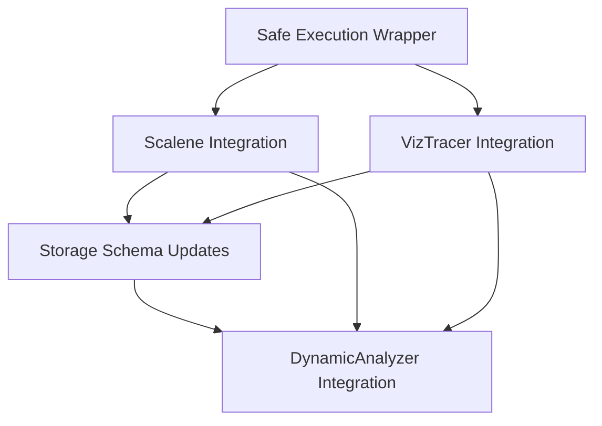

# Dynamic Analysis Integration Plan

## Overview
This plan outlines the integration of Scalene (CPU/memory profiling) and VizTracer (function call tracing) into the Hybrid Code Analyzer's DynamicAnalyzer module.

## Current System Analysis

### DynamicAnalyzer Workflow
The current `DynamicAnalyzer` performs the following operations:
1. `runtime_trace_execution()` - Uses Python's `trace` module for execution tracing
2. `profile_memory_usage()` - Uses `memory_profiler` for memory profiling
3. `generate_call_graph()` - Uses `pycg` for call graph generation
4. `dynamic_data_flow_analysis()` - Custom data flow analysis

### Storage Schema
The `AnalysisStorage` system stores:
- Complete analysis results as JSON in `full_results` column
- Execution failures in `execution_failures` column
- Metrics and coverage data
- Vector embeddings for semantic search

### Integration Points Identified
1. **Safe Execution Wrapper** - Need to ensure dynamic analysis runs in isolated subprocesses
2. **Profiling Methods** - Add new methods for Scalene and VizTracer integration
3. **Storage Schema** - Extend to accommodate new profiling data types
4. **Error Handling** - Maintain existing failure classification system
5. **CLI Integration** - Ensure no disruption to existing CLI interface

## Integration Strategy

### 1. Safe Execution Wrapper Design

**Task Name**: Create Safe Execution Wrapper
**Delegated To**: Orchestrator
**Description**: Design a subprocess-based execution wrapper that:
- Runs profiling tools in isolated environments
- Handles timeout and resource limits
- Captures stdout/stderr for analysis
- Normalizes file paths (Path vs str)
- Provides fallback mechanisms

**Implementation Approach**:
```python
def safe_execute_profiler(script_path: Union[str, Path], profiler_func, *args, **kwargs) -> Dict[str, Any]:
    """Execute profiler in isolated subprocess with safety checks"""
    try:
        # Convert Path to str for subprocess compatibility
        script_str = str(script_path) if isinstance(script_path, Path) else script_path
        
        # Create temporary execution script
        with tempfile.NamedTemporaryFile(mode='w', suffix='.py', delete=False) as temp_file:
            temp_file.write(f"""
import sys
from {profiler_func.__module__} import {profiler_func.__name__}

# Execute with profiling
result = {profiler_func.__name__}(*{args}, **{kwargs})
print(json.dumps(result))
""")
            temp_script = temp_file.name
        
        # Execute in subprocess with timeout
        result = subprocess.run([
            sys.executable, temp_script, script_str
        ], capture_output=True, text=True, timeout=180)
        
        # Parse and validate results
        if result.returncode == 0:
            return json.loads(result.stdout)
        else:
            raise RuntimeError(f"Profiler failed: {result.stderr}")
            
    except Exception as e:
        # Classify and handle failure
        failure = classify_profiler_failure(e, script_path, profiler_func.__name__)
        return {"error": str(e), "execution_failures": [failure]}
```

**Validation Criteria**:
- Profiler executes without crashing the main process
- File paths are properly normalized
- Timeout handling works correctly
- Error classification is maintained

### 2. Scalene Integration Plan

**Task Name**: Integrate Scalene CPU/Memory Profiling
**Delegated To**: Orchestrator
**Description**: Add Scalene profiling capabilities to DynamicAnalyzer with:
- CPU profiling (line-level granularity)
- Memory profiling (allocation tracking)
- GPU profiling (if available)
- AI-powered optimization suggestions

**Implementation Steps**:

1. **Add Scalene Profiling Method**:
```python
def profile_with_scalene(self, script_path: Union[str, Path]) -> Dict[str, Any]:
    """Profile script using Scalene for CPU, memory, and GPU analysis"""
    context = self._get_execution_context(script_path, "scalene_profiling")
    
    try:
        # Use safe execution wrapper
        result = safe_execute_profiler(
            script_path, 
            self._run_scalene_profiling,
            script_path
        )
        
        # Parse Scalene output
        scalene_data = self._parse_scalene_output(result)
        
        # Check for execution errors
        if result.get('stderr'):
            failure = ExecutionFailure(
                failure_type=FailureType.TOOL_ERROR,
                severity=FailureSeverity.WARNING,
                message="Scalene produced stderr output",
                context=context,
                raw_error=result['stderr'],
                is_analysis_finding=False
            )
            self._record_failure(failure)
        
        return scalene_data
        
    except Exception as e:
        failure = self._classify_failure(e, context)
        self._record_failure(failure)
        return {"error": f"Scalene profiling failed: {str(e)}", "execution_failures": [failure]}
```

2. **Add Scalene Execution Method**:
```python
def _run_scalene_profiling(self, script_path: str) -> Dict[str, Any]:
    """Run Scalene profiling on target script"""
    from scalene import scalene_profiler
    
    # Execute script with Scalene profiling
    with scalene_profiler.enable_profiling():
        # Import and execute target script
        spec = importlib.util.spec_from_file_location("target_module", script_path)
        module = importlib.util.module_from_spec(spec)
        spec.loader.exec_module(module)
    
    # Get profiling results
    return scalene_profiler.get_profiling_results()
```

3. **Add Scalene Output Parser**:
```python
def _parse_scalene_output(self, scalene_data: Dict[str, Any]) -> Dict[str, Any]:
    """Parse Scalene profiling output into standardized format"""
    return {
        "cpu_profiling": {
            "hot_spots": scalene_data.get("cpu_hot_spots", []),
            "line_level": scalene_data.get("cpu_line_level", {}),
            "total_time": scalene_data.get("total_time", 0)
        },
        "memory_profiling": {
            "allocations": scalene_data.get("memory_allocations", []),
            "peak_usage": scalene_data.get("peak_memory", 0),
            "growth_patterns": scalene_data.get("memory_growth", [])
        },
        "gpu_profiling": scalene_data.get("gpu_data", {}),
        "optimization_suggestions": scalene_data.get("ai_suggestions", []),
        "coverage": len(scalene_data.get("cpu_line_level", {})) / 1000  # Simplified
    }
```

**Validation Criteria**:
- Scalene profiling runs successfully on sample scripts
- CPU, memory, and GPU data is captured correctly
- Results are stored in AnalysisStorage without schema conflicts
- No performance degradation in existing functionality

### 3. VizTracer Integration Plan

**Task Name**: Integrate VizTracer Function Call Tracing
**Delegated To**: Orchestrator
**Description**: Add VizTracer for comprehensive function call tracing with:
- Function entry/exit logging
- Argument and return value tracking
- Exception tracing
- Execution flow visualization

**Implementation Steps**:

1. **Add VizTracer Tracing Method**:
```python
def trace_with_viztracer(self, script_path: Union[str, Path]) -> Dict[str, Any]:
    """Trace script execution using VizTracer for function call analysis"""
    context = self._get_execution_context(script_path, "viztracer_tracing")
    
    try:
        # Use safe execution wrapper
        result = safe_execute_profiler(
            script_path,
            self._run_viztracer_tracing,
            script_path
        )
        
        # Parse VizTracer output
        trace_data = self._parse_viztracer_output(result)
        
        # Check for execution errors
        if result.get('stderr'):
            failure = ExecutionFailure(
                failure_type=FailureType.TOOL_ERROR,
                severity=FailureSeverity.WARNING,
                message="VizTracer produced stderr output",
                context=context,
                raw_error=result['stderr'],
                is_analysis_finding=False
            )
            self._record_failure(failure)
        
        return trace_data
        
    except Exception as e:
        failure = self._classify_failure(e, context)
        self._record_failure(failure)
        return {"error": f"VizTracer tracing failed: {str(e)}", "execution_failures": [failure]}
```

2. **Add VizTracer Execution Method**:
```python
def _run_viztracer_tracing(self, script_path: str) -> Dict[str, Any]:
    """Run VizTracer on target script with comprehensive tracing"""
    from viztracer import VizTracer
    import json
    
    # Configure VizTracer with comprehensive options
    tracer = VizTracer(
        log_func_args=True,
        log_func_retval=True,
        log_func_entry=True,
        max_stack_depth=20
    )
    
    # Start tracing
    tracer.start()
    
    try:
        # Import and execute target script
        spec = importlib.util.spec_from_file_location("target_module", script_path)
        module = importlib.util.module_from_spec(spec)
        spec.loader.exec_module(module)
        
    finally:
        # Stop tracing and get results
        tracer.stop()
        
        # Save to temporary file and parse
        with tempfile.NamedTemporaryFile(mode='w', suffix='.json', delete=False) as f:
            tracer.save(output_file=f.name)
            
            # Parse the JSON output
            with open(f.name, 'r') as json_file:
                return json.load(json_file)
```

3. **Add VizTracer Output Parser**:
```python
def _parse_viztracer_output(self, trace_data: Dict[str, Any]) -> Dict[str, Any]:
    """Parse VizTracer output into standardized format"""
    
    # Extract function calls
    function_calls = []
    for event in trace_data.get("traceEvents", []):
        if event.get("ph") == "X" and "name" in event:  # Complete events
            function_calls.append({
                "function_name": event["name"],
                "start_time": event.get("ts", 0),
                "duration": event.get("dur", 0),
                "args": event.get("args", {}).get("func_args", ""),
                "return_value": event.get("args", {}).get("return_value", ""),
                "file": event.get("args", {}).get("file", ""),
                "line": event.get("args", {}).get("line", 0)
            })
    
    # Extract exceptions
    exceptions = []
    for event in trace_data.get("traceEvents", []):
        if event.get("ph") == "i" and "exception" in event.get("name", ""):
            exceptions.append({
                "exception_type": event["name"],
                "timestamp": event.get("ts", 0),
                "file": event.get("args", {}).get("file", ""),
                "line": event.get("args", {}).get("line", 0),
                "context": event.get("args", {}).get("context", "")
            })
    
    return {
        "function_calls": function_calls,
        "call_count": len(function_calls),
        "exception_trace": exceptions,
        "execution_flow": self._extract_execution_flow(trace_data),
        "coverage": len(function_calls) / 100  # Simplified coverage metric
    }
```

**Validation Criteria**:
- VizTracer captures function calls and exceptions correctly
- Argument and return value logging works as expected
- Execution flow data is properly structured
- No disruption to existing tracing functionality

### 4. Storage Schema Updates

**Task Name**: Update Storage Schema for New Profiling Data
**Delegated To**: Orchestrator
**Description**: Extend AnalysisStorage to accommodate Scalene and VizTracer data while preserving existing schema.

**Schema Changes Required**:

1. **Extend AnalysisResult Table**:
```python
# Add new columns to AnalysisResult
scalene_cpu_data = Column(JSON)  # Scalene CPU profiling results
scalene_memory_data = Column(JSON)  # Scalene memory profiling results  
scalene_gpu_data = Column(JSON)  # Scalene GPU profiling results (if available)
scalene_ai_suggestions = Column(JSON)  # AI optimization suggestions

viztracer_call_data = Column(JSON)  # VizTracer function call tracing
viztracer_exception_data = Column(JSON)  # VizTracer exception tracing
viztracer_flow_data = Column(JSON)  # Execution flow visualization data
```

2. **Update Metrics Calculation**:
```python
def _calculate_metrics(self, results: Dict[str, Any]) -> Dict[str, float]:
    metrics = super()._calculate_metrics(results)
    
    # Add Scalene metrics
    if 'scalene_profiling' in results:
        metrics['cpu_hotspots'] = len(results['scalene_profiling'].get('cpu_hot_spots', []))
        metrics['peak_memory_mb'] = results['scalene_profiling'].get('peak_memory', 0)
        metrics['memory_allocations'] = len(results['scalene_profiling'].get('memory_allocations', []))
    
    # Add VizTracer metrics
    if 'viztracer_tracing' in results:
        metrics['function_calls'] = results['viztracer_tracing'].get('call_count', 0)
        metrics['exceptions_traced'] = len(results['viztracer_tracing'].get('exception_trace', []))
        metrics['execution_flow_complexity'] = len(results['viztracer_tracing'].get('execution_flow', []))
    
    return metrics
```

3. **Update Summary Generation**:
```python
def _generate_summary(self, results: Dict[str, Any]) -> str:
    summary = super()._generate_summary(results)
    
    # Add Scalene summary
    if 'scalene_profiling' in results:
        scalene = results['scalene_profiling']
        summary += f" Scalene: {scalene.get('cpu_hot_spots_count', 0)} CPU hotspots, "
        summary += f"{scalene.get('peak_memory', 0):.1f}MB peak memory"
    
    # Add VizTracer summary
    if 'viztracer_tracing' in results:
        viztracer = results['viztracer_tracing']
        summary += f" VizTracer: {viztracer.get('call_count', 0)} function calls, "
        summary += f"{len(viztracer.get('exception_trace', []))} exceptions traced"
    
    return summary
```

**Validation Criteria**:
- New data fields are stored correctly in SQLite
- Existing analysis results remain accessible
- Metrics calculation includes new profiling data
- Vector embeddings work with extended data

### 5. DynamicAnalyzer Integration

**Task Name**: Integrate New Methods into DynamicAnalyzer Workflow
**Delegated To**: Orchestrator
**Description**: Add Scalene and VizTracer methods to the main analysis workflow while maintaining backward compatibility.

**Implementation Steps**:

1. **Update run_dynamic_analysis Method**:
```python
def run_dynamic_analysis(self, directory: str) -> Dict[str, Any]:
    # ... existing code ...
    
    for script in scripts:
        script_analysis = {}
        script_successful = True
        
        # ... existing analysis methods ...
        
        # Add Scalene profiling
        try:
            script_analysis["scalene_profiling"] = self.profile_with_scalene(script)
            execution_coverage["method_coverage"]["scalene_profiling"] += 1
        except Exception as e:
            # ... error handling ...
            script_successful = False
        
        # Add VizTracer tracing
        try:
            script_analysis["viztracer_tracing"] = self.trace_with_viztracer(script)
            execution_coverage["method_coverage"]["viztracer_tracing"] += 1
        except Exception as e:
            # ... error handling ...
            script_successful = False
        
        # ... rest of existing code ...
```

2. **Update Method Coverage Tracking**:
```python
execution_coverage = {
    "scripts_discovered": len(scripts),
    "scripts_analyzed": 0,
    "scripts_skipped": 0,
    "execution_success_rate": 0.0,
    "execution_time_metrics": {
        "total_execution_time": 0.0,
        "average_execution_time": 0.0
    },
    "method_coverage": {
        "runtime_trace": 0,
        "memory_profile": 0,  # Keep for backward compatibility
        "call_graph": 0,
        "data_flow": 0,
        "scalene_profiling": 0,  # New
        "viztracer_tracing": 0   # New
    },
    "failure_context": []
}
```

**Validation Criteria**:
- New profiling methods execute in correct sequence
- Method coverage tracking includes new methods
- Backward compatibility maintained for existing methods
- No performance regression in overall analysis

### 6. Configuration Updates

**Task Name**: Add Configuration for New Profiling Tools
**Delegated To**: Orchestrator
**Description**: Update settings.py to include configuration options for Scalene and VizTracer.

**Configuration Additions**:
```python
class Settings:
    # ... existing settings ...
    
    # Profiling Tool Configuration
    SCALENE_ENABLED = os.getenv("SCALENE_ENABLED", "true").lower() == "true"
    SCALENE_TIMEOUT = int(os.getenv("SCALENE_TIMEOUT", "180"))
    SCALENE_CPU_ONLY = os.getenv("SCALENE_CPU_ONLY", "false").lower() == "true"
    
    VIZTRACER_ENABLED = os.getenv("VIZTRACER_ENABLED", "true").lower() == "true"
    VIZTRACER_TIMEOUT = int(os.getenv("VIZTRACER_TIMEOUT", "120"))
    VIZTRACER_LOG_ARGS = os.getenv("VIZTRACER_LOG_ARGS", "true").lower() == "true"
    VIZTRACER_LOG_RETVAL = os.getenv("VIZTRACER_LOG_RETVAL", "true").lower() == "true"
    VIZTRACER_MAX_DEPTH = int(os.getenv("VIZTRACER_MAX_DEPTH", "20"))
```

**Validation Criteria**:
- Configuration options work correctly
- Environment variables override defaults
- Disabling tools works as expected

## Implementation Sequence

### Recommended Order of Implementation

1. **Safe Execution Wrapper** (Prerequisite for all profiling)
2. **Configuration Updates** (Enable/disable features)
3. **Scalene Integration** (CPU/Memory profiling)
4. **VizTracer Integration** (Function call tracing)
5. **Storage Schema Updates** (Accommodate new data)
6. **DynamicAnalyzer Integration** (Workflow updates)
7. **Validation and Testing** (Comprehensive testing)

### Dependency Diagram



## Validation Checkpoints

### After Each Implementation Step

1. **Safe Execution Wrapper**:
   - Verify subprocess isolation works
   - Test timeout handling
   - Confirm path normalization
   - Validate error classification

2. **Scalene Integration**:
   - Test CPU profiling on sample scripts
   - Verify memory profiling accuracy
   - Check GPU profiling (if available)
   - Validate storage of profiling data

3. **VizTracer Integration**:
   - Test function call tracing
   - Verify exception tracking
   - Check argument/return value logging
   - Validate execution flow data

4. **Storage Schema Updates**:
   - Verify new columns are created
   - Test data retrieval
   - Check metrics calculation
   - Validate backward compatibility

5. **DynamicAnalyzer Integration**:
   - Test complete analysis workflow
   - Verify method coverage tracking
   - Check performance impact
   - Validate error handling

## Expected Outputs

### Scalene Profiling Output Example
```json
{
  "scalene_profiling": {
    "cpu_profiling": {
      "hot_spots": [
        {
          "function": "process_data",
          "file": "script.py",
          "line": 42,
          "time_percentage": 25.3,
          "self_time": 1.2
        }
      ],
      "line_level": {
        "script.py:42": {
          "hits": 1000,
          "time": 1.2
        }
      },
      "total_time": 4.7
    },
    "memory_profiling": {
      "allocations": [
        {
          "function": "load_data",
          "allocations": 500,
          "peak": 128
        }
      ],
      "peak_usage": 256,
      "growth_patterns": []
    },
    "gpu_profiling": {},
    "optimization_suggestions": [
      "Consider caching results of process_data()",
      "Reduce memory allocations in load_data()"
    ],
    "coverage": 0.85
  }
}
```

### VizTracer Tracing Output Example
```json
{
  "viztracer_tracing": {
    "function_calls": [
      {
        "function_name": "process_data",
        "start_time": 1000,
        "duration": 500,
        "args": "(input='data.csv', cache=False)",
        "return_value": "<DataFrame object>",
        "file": "script.py",
        "line": 42
      }
    ],
    "call_count": 150,
    "exception_trace": [
      {
        "exception_type": "FileNotFoundError",
        "timestamp": 1500,
        "file": "script.py",
        "line": 87,
        "context": "Opening missing file"
      }
    ],
    "execution_flow": [
      {
        "from": "main",
        "to": "process_data",
        "timestamp": 1000
      }
    ],
    "coverage": 0.92
  }
}
```

## Success Criteria

### Overall Integration Success
- All profiling tools execute safely without crashing the main process
- New profiling data is captured accurately and stored correctly
- Existing functionality remains unaffected (backward compatibility)
- Performance impact is minimal (<10% increase in analysis time)
- Error handling and classification work correctly for new tools
- CLI interface remains unchanged
- Storage and retrieval of extended data works correctly

### Specific Tool Success Criteria

**Scalene**:
- CPU profiling identifies hot spots accurately
- Memory profiling tracks allocations correctly
- GPU profiling works when available
- AI suggestions are generated and stored

**VizTracer**:
- Function calls are traced with arguments and return values
- Exceptions are captured with full context
- Execution flow is visualized correctly
- Performance overhead is acceptable

## Risk Assessment and Mitigation

### Potential Risks

1. **Performance Impact**: New profiling tools may significantly slow down analysis
   - *Mitigation*: Implement timeout controls and selective profiling

2. **Storage Schema Conflicts**: New data may conflict with existing storage
   - *Mitigation*: Use JSON columns for flexibility and backward compatibility

3. **Tool Compatibility**: Scalene/VizTracer may not work with all Python versions
   - *Mitigation*: Add version checks and graceful fallback mechanisms

4. **Resource Consumption**: Profiling tools may consume excessive memory
   - *Mitigation*: Implement resource limits and subprocess isolation

5. **Data Volume**: New profiling data may increase storage requirements
   - *Mitigation*: Add data compression and selective storage options

## Rollback Plan

If integration fails or causes issues:
1. Disable new profiling tools via configuration
2. Revert to previous DynamicAnalyzer methods
3. Maintain all existing functionality
4. Provide clear error messages for missing features

## Next Steps

This plan is ready for review and approval. Once approved, the Orchestrator can begin implementing each task in the specified sequence, with validation checkpoints after each major step.