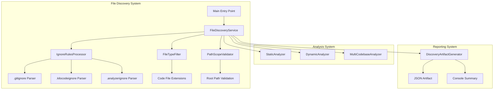

# Folder Path Handling and Ignore Rules Architecture

## Overview

This document outlines the architectural design for adding robust folder path handling and ignore rules to the hybrid code analyzer. The solution introduces a dedicated file discovery and ignore processing system that operates as a first-class, pre-analysis stage.

## Core Requirements Analysis

Based on the requirements, the system must:

1. **File discovery as first-class stage**: All ignore logic and filtering must occur before analysis
2. **Ignore file support**: Support `.gitignore` and `.kilocodeignore` with `.gitignore` taking precedence
3. **Analyzer-specific ignore**: Support optional `.analyzerignore` file
4. **Graceful fallback**: Default to "ignore nothing" if no ignore files exist
5. **Path scoping**: Accept one or more root folder paths
6. **File-type filtering**: Exclude non-code files during discovery
7. **Deterministic reporting**: Record discovery results and ignore decisions

## Current Architecture Analysis

### Current File Discovery Implementation

**Static Analyzer** (`analyzer/static_analyzer.py`):
- Uses `os.walk(codebase_path)` for file discovery
- No ignore rules processing
- Basic file type tracking via extensions
- No pre-filtering before analysis

**Dynamic Analyzer** (`analyzer/dynamic_analyzer.py`):
- Uses `Path(directory).rglob("*.py")` for Python file discovery
- Hardcoded to Python files only
- No ignore rules processing
- No comprehensive file type filtering

**Issues with Current Approach**:
- No centralized file discovery mechanism
- No ignore rules support
- File filtering happens during analysis, not before
- Inconsistent file discovery between analyzers
- No deterministic reporting of discovery process

## Proposed Architecture

### High-Level Design



### Component Breakdown

#### 1. FileDiscoveryService (New Module)

**Responsibilities**:
- Centralized file discovery entry point
- Coordinate ignore rules processing
- Apply file type filtering
- Validate path scoping
- Generate discovery artifacts

**Key Methods**:
- `discover_files(root_paths: List[str], analyzer_type: str = None) -> DiscoveryResult`
- `apply_ignore_rules(files: List[str], root_path: str) -> List[str]`
- `filter_file_types(files: List[str]) -> List[str]`
- `validate_paths(root_paths: List[str]) -> bool`

#### 2. IgnoreRulesProcessor (New Module)

**Responsibilities**:
- Parse and process ignore files
- Apply gitignore-style pattern matching
- Handle precedence rules (.gitignore > .kilocodeignore)
- Support analyzer-specific ignore files
- Provide detailed ignore reporting

**Key Methods**:
- `load_ignore_rules(root_path: str, analyzer_type: str = None) -> IgnoreRules`
- `should_ignore_file(file_path: str, rules: IgnoreRules) -> bool`
- `get_ignore_reason(file_path: str, rules: IgnoreRules) -> str`

**Ignore File Precedence**:
1. `.gitignore` (highest priority)
2. `.kilocodeignore` 
3. `.analyzerignore` (lowest priority, analyzer-specific)

#### 3. FileTypeFilter (New Module)

**Responsibilities**:
- Maintain list of supported code file extensions
- Filter out non-code files
- Support custom file type configurations
- Provide deterministic filtering results

**Default Supported Extensions**:
```python
DEFAULT_CODE_EXTENSIONS = {
    '.py', '.js', '.ts', '.java', '.c', '.cpp', '.cs', '.go', 
    '.rb', '.php', '.swift', '.kt', '.scala', '.rs', '.sh'
}
```

#### 4. PathScopeValidator (New Module)

**Responsibilities**:
- Validate that all discovered files are within root paths
- Prevent directory traversal vulnerabilities
- Ensure path normalization
- Provide path validation reporting

#### 5. DiscoveryArtifactGenerator (New Module)

**Responsibilities**:
- Generate structured JSON artifacts
- Create human-readable console summaries
- Track discovery metrics
- Provide detailed ignore reporting

**Artifact Structure**:
```json
{
  "discovery_timestamp": "2024-01-16T22:45:00Z",
  "root_paths": ["/path/to/codebase"],
  "files_discovered": 150,
  "files_ignored_by_rule": 45,
  "files_ignored_by_type": 20,
  "files_passed_to_analysis": 85,
  "ignore_rules_applied": [
    {
      "file": ".gitignore",
      "patterns_applied": ["node_modules/", "*.log"],
      "files_ignored": ["node_modules/package.json", "debug.log"]
    }
  ],
  "file_type_filtering": {
    "supported_extensions": [".py", ".js"],
    "ignored_extensions": [".txt", ".md"]
  }
}
```

## Implementation Plan

### New Files to Create

1. **`analyzer/file_discovery.py`** - Main file discovery service
2. **`analyzer/ignore_rules.py`** - Ignore rules processing
3. **`analyzer/file_type_filter.py`** - File type filtering
4. **`analyzer/path_validator.py`** - Path scope validation
5. **`analyzer/discovery_artifact.py`** - Artifact generation

### Files to Modify

1. **`analyzer/static_analyzer.py`** - Use FileDiscoveryService instead of os.walk
2. **`analyzer/dynamic_analyzer.py`** - Use FileDiscoveryService instead of Path.rglob
3. **`analyzer/multi_codebase.py`** - Pass root paths to discovery service
4. **`main.py`** - Update to support multiple root paths

### Detailed Implementation Steps

#### Step 1: Create FileDiscoveryService

```python
class FileDiscoveryService:
    def __init__(self):
        self.ignore_processor = IgnoreRulesProcessor()
        self.file_type_filter = FileTypeFilter()
        self.path_validator = PathScopeValidator()
        self.artifact_generator = DiscoveryArtifactGenerator()
    
    def discover_files(self, root_paths: List[str], analyzer_type: str = None) -> DiscoveryResult:
        """Main file discovery method with full ignore processing"""
        # Validate input paths
        self.path_validator.validate_paths(root_paths)
        
        # Discover all files in root paths
        all_files = self._discover_all_files(root_paths)
        
        # Apply ignore rules
        filtered_files, ignore_report = self._apply_ignore_rules(all_files, root_paths, analyzer_type)
        
        # Apply file type filtering
        code_files, type_filter_report = self.file_type_filter.filter_files(filtered_files)
        
        # Generate discovery artifacts
        discovery_result = self.artifact_generator.generate_artifact(
            all_files, 
            ignore_report, 
            type_filter_report, 
            code_files
        )
        
        return discovery_result
```

#### Step 2: Implement IgnoreRulesProcessor

```python
class IgnoreRulesProcessor:
    def __init__(self):
        self.pattern_cache = {}
    
    def load_ignore_rules(self, root_path: str, analyzer_type: str = None) -> IgnoreRules:
        """Load and merge ignore rules from multiple sources"""
        rules = IgnoreRules()
        
        # Load .gitignore (highest priority)
        gitignore_path = os.path.join(root_path, '.gitignore')
        if os.path.exists(gitignore_path):
            rules.add_rules(self._parse_gitignore(gitignore_path), source='.gitignore')
        
        # Load .kilocodeignore
        kiloignore_path = os.path.join(root_path, '.kilocodeignore')
        if os.path.exists(kiloignore_path):
            rules.add_rules(self._parse_gitignore(kiloignore_path), source='.kilocodeignore')
        
        # Load analyzer-specific ignore file
        if analyzer_type:
            analyzer_ignore = os.path.join(root_path, f'.{analyzer_type}ignore')
            if os.path.exists(analyzer_ignore):
                rules.add_rules(self._parse_gitignore(analyzer_ignore), source=f'.{analyzer_type}ignore')
        
        return rules
```

#### Step 3: Update StaticAnalyzer

```python
# In analyzer/static_analyzer.py

def analyze_codebase(self, codebase_path: str) -> Dict[str, Any]:
    # Use file discovery service instead of os.walk
    discovery_service = FileDiscoveryService()
    discovery_result = discovery_service.discover_files([codebase_path], analyzer_type='static')
    
    # Get pre-filtered list of files
    files_to_analyze = discovery_result.files_passed_to_analysis
    
    # Store discovery artifact for reporting
    analysis['discovery_artifact'] = discovery_result.to_dict()
    
    # Continue with analysis using pre-filtered files
    for file_path in files_to_analyze:
        # Existing analysis logic
        pass
```

#### Step 4: Update DynamicAnalyzer

```python
# In analyzer/dynamic_analyzer.py

def run_dynamic_analysis(self, directory: str) -> Dict[str, Any]:
    # Use file discovery service instead of Path.rglob
    discovery_service = FileDiscoveryService()
    discovery_result = discovery_service.discover_files([directory], analyzer_type='dynamic')
    
    # Get pre-filtered list of files
    scripts = discovery_result.files_passed_to_analysis
    
    # Store discovery artifact for reporting
    execution_coverage['discovery_artifact'] = discovery_result.to_dict()
    
    # Continue with analysis using pre-filtered files
    for script in scripts:
        # Existing analysis logic
        pass
```

## Ordering Guarantees

### Discovery Phase Order

1. **Path Validation** - Validate root paths exist and are accessible
2. **File Discovery** - Recursively find all files in root paths
3. **Ignore Rules Application** - Apply .gitignore, .kilocodeignore, .analyzerignore patterns
4. **File Type Filtering** - Filter out non-code files
5. **Path Scope Validation** - Ensure all files are within root paths
6. **Artifact Generation** - Create structured discovery report

### Analysis Phase Order

1. **Receive Pre-Filtered Files** - Analyzers only get clean file list
2. **Perform Analysis** - No additional filtering needed
3. **Generate Results** - Include discovery artifact in final report

## Deterministic Reporting

### Console Output (Human-Readable)

```
File Discovery Summary:
- Root Paths: /path/to/codebase
- Files Discovered: 150
- Files Ignored by Rules: 45 (.gitignore: 30, .kilocodeignore: 15)
- Files Ignored by Type: 20
- Files Passed to Analysis: 85
- Analysis Coverage: 56.67%
```

### JSON Artifact (Machine-Readable)

```json
{
  "discovery_metadata": {
    "timestamp": "2024-01-16T22:45:00Z",
    "analyzer_type": "static",
    "execution_time_ms": 125
  },
  "paths": {
    "root_paths": ["/path/to/codebase"],
    "discovery_scope": "recursive"
  },
  "discovery_results": {
    "total_files_discovered": 150,
    "files_by_extension": {
      ".py": 80,
      ".js": 30,
      ".txt": 25,
      ".md": 15
    }
  },
  "ignore_processing": {
    "rules_sources": [".gitignore", ".kilocodeignore"],
    "total_files_ignored_by_rule": 45,
    "rules_applied": [
      {
        "source": ".gitignore",
        "patterns": ["node_modules/", "*.log"],
        "files_ignored": ["node_modules/package.json", "debug.log"],
        "ignore_count": 30
      }
    ]
  },
  "file_type_filtering": {
    "supported_extensions": [".py", ".js", ".ts"],
    "total_files_ignored_by_type": 20,
    "ignored_extensions": {
      ".txt": 15,
      ".md": 5
    }
  },
  "final_results": {
    "files_passed_to_analysis": 85,
    "analysis_coverage_percentage": 56.67,
    "file_list": ["file1.py", "file2.js", ...]
  }
}
```

## Integration with Existing Architecture

### MultiCodebaseAnalyzer Updates

```python
class MultiCodebaseAnalyzer:
    def analyze_single(self, codebase_path: str, question: str = "Analyze this codebase") -> Dict[str, Any]:
        # Use file discovery service for both analyzers
        discovery_service = FileDiscoveryService()
        
        # Get discovery results for static analysis
        static_discovery = discovery_service.discover_files([codebase_path], analyzer_type='static')
        
        # Get discovery results for dynamic analysis  
        dynamic_discovery = discovery_service.discover_files([codebase_path], analyzer_type='dynamic')
        
        # Pass pre-filtered files to analyzers
        static_analysis = self.static_analyzer.analyze_codebase_with_files(
            codebase_path, 
            static_discovery.files_passed_to_analysis
        )
        
        dynamic_analysis = self.dynamic_analyzer.run_dynamic_analysis_with_files(
            codebase_path,
            dynamic_discovery.files_passed_to_analysis
        )
        
        # Include discovery artifacts in final result
        result['discovery_artifacts'] = {
            'static': static_discovery.to_dict(),
            'dynamic': dynamic_discovery.to_dict()
        }
```

## Error Handling and Edge Cases

### No Ignore Files Present
- System defaults to "ignore nothing" behavior
- All files are processed through file type filtering
- No conditional logic downstream - clean file list always provided

### Invalid Root Paths
- PathScopeValidator throws clear exceptions
- Discovery phase fails fast with meaningful error messages
- No partial or inconsistent results

### Circular Symlinks
- File discovery uses `os.walk` with proper handling
- Path validation catches directory traversal attempts
- System remains secure and deterministic

## Testing Strategy

### Unit Tests
- Test ignore rule parsing and precedence
- Test file type filtering logic
- Test path validation edge cases
- Test artifact generation accuracy

### Integration Tests
- Test full discovery pipeline
- Test analyzer integration
- Test multiple root paths
- Test various ignore file combinations

### End-to-End Tests
- Test complete analysis workflow
- Validate discovery artifacts
- Verify reporting accuracy
- Test performance with large codebases

## Performance Considerations

### Caching Strategy
- Cache parsed ignore rules per root path
- Cache file type filtering results
- Cache path validation results

### Parallel Processing
- File discovery can be parallelized per root path
- Ignore rule application can be batched
- File type filtering is lightweight and fast

### Memory Efficiency
- Stream file discovery results
- Use generators where possible
- Avoid loading entire file contents during discovery

## Backward Compatibility

### Existing Functionality
- All current analysis capabilities preserved
- Only file discovery mechanism changes
- Final analysis results structure unchanged

### Migration Path
- Gradual adoption possible
- Can run both old and new discovery in parallel
- Easy rollback if needed

## Delegation to Orchestrator Agent

The following concrete implementation tasks should be delegated:

1. **Create File Discovery Module**:
   - Implement `FileDiscoveryService` class
   - Create `discover_files()` method with full pipeline
   - Add proper error handling and logging

2. **Implement Ignore Rules Processor**:
   - Create `IgnoreRulesProcessor` class
   - Implement gitignore-style pattern matching
   - Handle precedence rules correctly
   - Add detailed ignore reporting

3. **Build File Type Filter**:
   - Implement `FileTypeFilter` class
   - Define supported code extensions
   - Create deterministic filtering logic

4. **Add Path Validation**:
   - Implement `PathScopeValidator` class
   - Add security checks for directory traversal
   - Ensure path normalization

5. **Create Artifact Generator**:
   - Implement `DiscoveryArtifactGenerator` class
   - Design JSON artifact structure
   - Add console summary generation

6. **Update Static Analyzer**:
   - Replace `os.walk()` with FileDiscoveryService
   - Integrate discovery artifacts into results
   - Update metrics calculation

7. **Update Dynamic Analyzer**:
   - Replace `Path.rglob()` with FileDiscoveryService
   - Integrate discovery artifacts into results
   - Update coverage tracking

8. **Update MultiCodebase Analyzer**:
   - Coordinate discovery for both analyzer types
   - Aggregate discovery artifacts
   - Update completeness metrics

9. **Update Main Entry Point**:
   - Support multiple root paths
   - Add discovery reporting options
   - Maintain backward compatibility

10. **Add Comprehensive Tests**:
    - Unit tests for all new components
    - Integration tests for discovery pipeline
    - End-to-end tests for full workflow

## Expected Outcomes

1. **Clean Architecture**: Separation of concerns between discovery and analysis
2. **Robust Ignore Support**: Full gitignore-style pattern matching
3. **Deterministic Behavior**: Consistent results regardless of environment
4. **Comprehensive Reporting**: Detailed discovery artifacts for debugging
5. **Improved Security**: Proper path validation and scoping
6. **Better Performance**: Efficient file discovery and filtering
7. **Enhanced Maintainability**: Clear component boundaries and responsibilities

## Validation Criteria

- File discovery operates as pre-analysis stage
- All ignore rules properly applied with correct precedence
- Non-code files filtered out before analysis
- Discovery artifacts contain complete reporting data
- Analyzers receive only pre-filtered file lists
- System defaults to "ignore nothing" when no ignore files present
- Multiple root paths supported and validated
- Performance meets requirements for large codebases