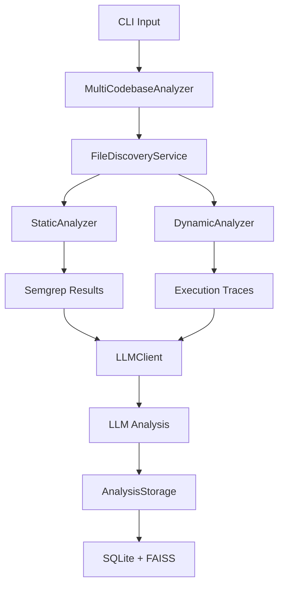

# Hybrid Code Analyzer - Technical State Report

## 1. High-Level Architecture

### Main Components and Responsibilities

* **Main CLI (`main.py`)**: Entry point, argument parsing, result processing, and orchestration
* **MultiCodebaseAnalyzer**: Coordinates analysis across static, dynamic, and LLM components
* **StaticAnalyzer**: Semgrep integration, custom file analysis, coverage tracking
* **DynamicAnalyzer**: Runtime tracing, memory profiling, call graph generation, execution coverage
* **LLMClient**: Interface to Ollama/vLLM backends for semantic analysis
* **FileDiscoveryService**: File discovery with ignore rules and type filtering
* **AnalysisStorage**: SQLite database + FAISS vector store for analysis history

### Data Flow

### Orchestration vs Analysis vs Storage

* **Orchestration**: MultiCodebaseAnalyzer coordinates workflow
* **Analysis**: StaticAnalyzer, DynamicAnalyzer perform actual code analysis
* **Storage**: AnalysisStorage handles persistence and retrieval

## 2. Static Analysis Capabilities

### Implemented Static Analysis

* **Semgrep Integration**: Primary static analysis tool for bug detection
* **Custom File Analysis**: File type statistics, size distribution, complexity metrics
* **Coverage Tracking**: File discovery vs analysis coverage metrics
* **Error Handling**: File access errors, parsing errors, tool failures

### Tools Wrapped vs Custom

* **Wrapped Tools**: Semgrep (primary), SonarQube (mentioned but not implemented)
* **Custom Analysis**: File statistics, size analysis, complexity detection

### Outputs Produced

* Semgrep findings with severity levels
* File type distribution and size metrics
* Coverage percentage and completeness status
* Execution failure reports with classification

## 3. Dynamic Analysis Capabilities

### Implemented Dynamic Analysis

* **Runtime Tracing**: Execution path tracking using Python trace module
* **Memory Profiling**: Memory usage analysis with memory_profiler
* **Call Graph Generation**: Function call relationships using PyCG
* **Data Flow Analysis**: Input-based execution path tracing

### Parts That Execute Code

* `runtime_trace_execution()`: Executes scripts with trace module
* `profile_memory_usage()`: Executes scripts with memory profiler
* `dynamic_data_flow_analysis()`: Executes with different inputs

### Stubs, Incomplete, or Unsafe Parts

* **Call Graph Generation**: Uses PyCG which may not be installed/available
* **Memory Profiling**: Creates temporary scripts that execute arbitrary code
* **Error Handling**: Comprehensive but execution failures are expected findings
* **Security**: No sandboxing for executed code - potential security risk

## 4. Error Handling & Truthfulness

### Failure Detection

* **Structured Failure Classification**: ExecutionFailure class with type, severity, context
* **Failure Types**: FILE_ACCESS_ERROR, TOOL_ERROR, PARSING_ERROR, IMPORT_ERROR, etc.
* **Severity Levels**: INFO, WARNING, ERROR, CRITICAL
* **Analysis Findings vs Errors**: `is_analysis_finding` flag distinguishes valid findings from actual errors

### Failure Reporting

* **Comprehensive Logging**: Execution failures stored with full context
* **Aggregation**: Multi-codebase analyzer aggregates failures across analyses
* **Storage**: Execution failures stored in SQLite with searchable metadata

### "No Issues Found" Conditions

* **Complete Analysis**: When failure_count = 0 and coverage = 100%
* **Partial Analysis**: When failure_count > 0 but only analysis findings (not actual errors)
* **Failed Analysis**: When actual errors prevent meaningful analysis

## 5. FAISS / Vector Store Usage

### Where FAISS is Used

* **AnalysisStorage**: Stores vector embeddings of analysis results
* **Semantic Search**: Enables finding similar past analyses
* **Trend Analysis**: Supports code quality tracking over time

### What Data is Embedded

* **Analysis Summaries**: Key findings and metrics
* **LLM Analysis**: Semantic understanding of code issues
* **Issue Descriptions**: Top issues from static analysis
* **Completeness Context**: Coverage and execution metrics

### Usage Purpose

* **Memory**: Stores historical analysis patterns
* **Retrieval**: Semantic search for similar code quality issues
* **Trend Analysis**: Vector-based similarity for quality tracking

## 6. Ignore Rules & File Discovery

### File Discovery

* **Multiple Root Paths**: Supports analyzing across directory trees
* **Recursive Discovery**: Uses os.walk for comprehensive file finding
* **Path Validation**: Security checks for directory traversal prevention

### Ignore Rules Application

* **Precedence Order**: .analyzerignore (highest) > .gitignore > .kilocodeignore > defaults
* **Pattern Support**: Gitignore-style patterns with wildcards
* **Rule Caching**: Caches parsed rules for performance

### Path Handling Inconsistencies

* **Type Mixing**: Some functions use `str` paths, others use `Path` objects
* **Normalization**: Inconsistent path normalization across components
* **Error Handling**: Mixed exception handling for path-related errors

## 7. Type & Contract Discipline

### Type Mixing Issues

* **Path Types**: `str` vs `Path` objects inconsistently used
* **File Lists**: Some functions expect lists of strings, others Path objects
* **Configuration**: Settings mixed between environment variables and code defaults

### Missing Contracts

* **Component Interfaces**: No formal contracts between analyzers and discovery
* **Error Handling**: Inconsistent error propagation patterns
* **Data Validation**: Limited input validation for analysis parameters

### Assumptions Between Components

* **File Discovery**: Assumes analyzers can handle string paths
* **Error Handling**: Assumes all components use ExecutionFailure format
* **Configuration**: Assumes LLM backends are available and configured

## 8. Testing Reality Check

### Real Test Coverage

* **Unit Tests**: Basic functionality tests for analyzers
* **Integration Tests**: Multi-codebase workflow testing
* **Failure Testing**: Execution failure tracking verification
* **Completeness Testing**: Coverage metrics validation

### Assumptions That May Fail

* **Tool Availability**: Assumes Semgrep, PyCG, memory_profiler are installed
* **LLM Backend**: Assumes Ollama/vLLM servers are running
* **File System**: Assumes consistent file system behavior across platforms
* **Dependencies**: Assumes all Python dependencies are available

## Hard Blockers

1. **Security Risks**: Dynamic analysis executes arbitrary code without sandboxing
2. **Tool Dependencies**: Missing tools (PyCG, memory_profiler) cause silent failures
3. **Type Inconsistencies**: Mixed string/Path usage causes runtime errors
4. **Error Handling**: Some failures are treated as analysis findings when they're actual errors
5. **Configuration Complexity**: Multiple LLM backends with different requirements

## Soft Blockers

1. **Performance**: File discovery and analysis can be slow for large codebases
2. **Memory Usage**: FAISS and vector embeddings consume significant memory
3. **Platform Dependencies**: Windows vs Unix path handling differences
4. **Documentation**: Some features are implemented but not well documented
5. **Testing**: Limited end-to-end testing for complex workflows

## Summary

The hybrid code analyzer is a comprehensive tool with robust static and dynamic analysis capabilities, but has several architectural and implementation issues that affect reliability and usability. The core functionality works well for basic use cases, but advanced features and edge cases need improvement for production readiness.