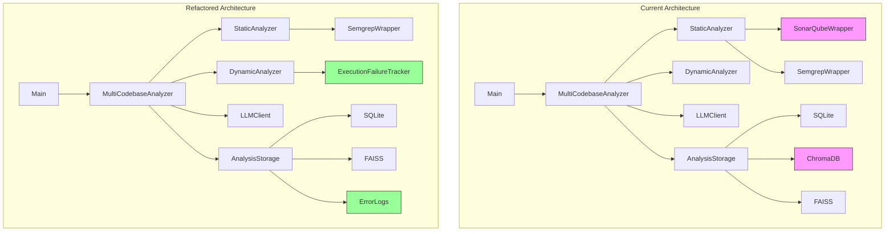

# Hybrid Code Analyzer Refactor Plan

## Overview
This plan outlines the architectural changes required to simplify and improve the hybrid code analyzer by removing dependencies, improving error handling, and enhancing reporting capabilities.

## Current Architecture Analysis

### Components to Remove/Modify

1. **ChromaDB**: Currently used for vector similarity search alongside FAISS
2. **SonarQube**: Used for static analysis alongside Semgrep
3. **Error Handling**: Execution failures are not treated as first-class findings
4. **Completeness Reporting**: No explicit tracking of analysis completeness
5. **Debuggability**: Limited storage of raw errors and execution logs

## Detailed Refactor Plan

### 1. Remove ChromaDB Entirely

**Files Affected:**
- `analyzer/analysis_storage.py` - Remove ChromaDB imports and usage
- `config/settings.py` - Remove any ChromaDB-related configuration

**Changes Required:**
- Remove all `chromadb` imports and related code
- Standardize vector similarity search on FAISS only
- Update storage methods to use FAISS exclusively
- Remove ChromaDB initialization and collection management

**Implementation Notes:**
- FAISS is already imported and partially implemented
- Vector embeddings should be stored in FAISS index only
- Maintain backward compatibility for existing SQLite data

### 2. Remove SonarQube Dependency

**Files Affected:**
- `tools/sonarqube_wrapper.py` - Delete entire file
- `analyzer/static_analyzer.py` - Remove SonarQube integration
- `config/settings.py` - Remove SonarQube configuration
- `main.py` - Update imports if needed

**Changes Required:**
- Remove all SonarQube-related imports and instantiation
- Update static analyzer to work with Semgrep only
- Modify analysis result structure to remove SonarQube-specific fields
- Update metrics calculation to work without SonarQube data

**Implementation Notes:**
- Semgrep should become the primary static analysis tool
- Maintain the same result structure but remove SonarQube-specific data
- Update documentation to reflect Semgrep-only static analysis

### 3. Promote Execution Failures to First-Class Findings

**Files Affected:**
- `analyzer/dynamic_analyzer.py` - Enhance error handling
- `analyzer/static_analyzer.py` - Improve tool failure handling
- `analyzer/multi_codebase.py` - Update analysis aggregation
- `analyzer/analysis_storage.py` - Add failure tracking

**Changes Required:**
- Create structured error reporting in analysis results
- Distinguish between "No issues found" and "Analysis incomplete"
- Track execution failures with detailed context
- Store raw stderr, tracebacks, and execution logs
- Clarify that dynamic execution failures due to missing context are valid findings, not analyzer errors

**Implementation Notes:**
- Add `execution_failures` field to analysis results
- Include failure classification (import errors, runtime exceptions, missing dependencies, etc.)
- Maintain separate counts for issues vs. failures
- For dynamic analysis: execution failures due to missing context should be treated as valid findings
- Provide clear context for why execution failed (missing imports, dependencies, environment issues)
- Distinguish between analyzer errors (bugs) and analysis findings (expected failures)

### 4. Introduce Analysis Completeness and Confidence Reporting

**Files Affected:**
- `analyzer/static_analyzer.py` - Add file discovery tracking
- `analyzer/dynamic_analyzer.py` - Add execution coverage tracking
- `analyzer/analysis_storage.py` - Add completeness metrics
- `analyzer/multi_codebase.py` - Aggregate completeness data

**Changes Required:**
- Track files discovered vs. files analyzed
- Track execution success/failure rates with context
- Calculate coverage metrics based on actual analysis scope
- Add failure context to provide meaningful interpretation
- Add completeness summary to final reports

**Implementation Notes:**
- Add metrics like: files_discovered, files_analyzed, files_skipped, execution_failures
- Calculate coverage as: (files_analyzed / files_discovered) * 100
- Include failure context (reason, type, severity) for each failure
- Refrain from naive confidence ratios - use coverage + failure context instead
- Provide clear distinction between "analysis complete" and "analysis incomplete with context"

### 5. Improve Debuggability

**Files Affected:**
- `analyzer/dynamic_analyzer.py` - Enhance error logging
- `analyzer/static_analyzer.py` - Add detailed error capture
- `analyzer/analysis_storage.py` - Store raw error data

**Changes Required:**
- Capture and store raw stderr from all subprocess calls
- Store complete tracebacks for exceptions
- Add execution logs with timestamps
- Avoid introducing new dependencies

**Implementation Notes:**
- Use existing logging capabilities
- Store errors as structured JSON in SQLite
- Include error context (file, line, tool, etc.)

## Component-Specific Changes

### Analysis Storage Refactor

**Current Issues:**
- Uses both ChromaDB and FAISS for vector search
- Mixed storage approach complicates maintenance
- FAISS index lifecycle not explicitly managed
- No clear ID linkage between SQLite records and FAISS vectors

**Changes:**
- Remove ChromaDB entirely
- Standardize on FAISS for vector similarity
- Use SQLAlchemy for all structured data
- Add execution failure tracking tables
- Explicitly define FAISS index lifecycle management
- Implement clear ID linkage between SQLite records and FAISS vectors
- Store FAISS index metadata in SQLite for recovery and consistency

**FAISS Index Management:**
- Create FAISS index on first analysis if not exists
- Load existing FAISS index from storage path
- Link each vector to SQLite record ID
- Save FAISS index after each update
- Handle index versioning and compatibility

**ID Linkage Strategy:**
- Use SQLite primary key as FAISS vector ID
- Store vector ID in SQLite record for bidirectional lookup
- Implement consistency checks between SQLite and FAISS
- Add recovery mechanism for orphaned vectors/records

### Static Analyzer Refactor

**Current Issues:**
- Depends on both SonarQube and Semgrep
- SonarQube dependency complicates setup

**Changes:**
- Remove SonarQube integration completely
- Make Semgrep the primary static analysis tool
- Enhance error handling for tool failures
- Add file discovery and coverage tracking

### Dynamic Analyzer Refactor

**Current Issues:**
- Execution failures not properly tracked
- Limited error context preservation

**Changes:**
- Enhance error capture and classification
- Track execution success/failure per file
- Store raw execution logs and stderr
- Add execution coverage metrics

## Implementation Phases

### Phase 1: Remove Deprecated Components
1. Remove ChromaDB from analysis_storage.py
2. Delete sonarqube_wrapper.py
3. Remove SonarQube from static_analyzer.py
4. Update configuration files

### Phase 2: Enhance Error Handling
1. Add execution failure tracking to all analyzers
2. Create structured error reporting
3. Implement completeness metrics
4. Add confidence scoring

### Phase 3: Improve Debuggability
1. Enhance error logging in dynamic analyzer
2. Add raw error storage to SQLite
3. Implement execution log capture
4. Update reporting to include debug info

### Phase 4: Testing and Validation
1. Test with various codebases
2. Validate error reporting
3. Verify completeness metrics
4. Ensure backward compatibility

## Delegation to Orchestrator Agent

The following concrete tasks should be delegated to the Orchestrator agent:

1. **Remove ChromaDB Implementation:**
   - Delete ChromaDB imports and usage from analysis_storage.py
   - Update vector search to use FAISS exclusively
   - Implement explicit FAISS index lifecycle management
   - Create clear ID linkage between SQLite records and FAISS vectors
   - Test vector similarity search functionality

2. **Remove SonarQube Integration:**
   - Delete sonarqube_wrapper.py file
   - Remove SonarQube references from static_analyzer.py
   - Update analysis result structure
   - Test static analysis with Semgrep only

3. **Enhance Execution Failure Handling:**
   - Add execution failure tracking to all analyzer methods
   - Create structured error reporting format
   - Clarify that dynamic execution failures due to missing context are valid findings
   - Distinguish between analyzer errors and analysis findings
   - Update result aggregation to include failures with context
   - Test error scenarios

4. **Implement Completeness Metrics:**
   - Add file discovery and coverage tracking
   - Implement coverage calculation (not naive confidence ratios)
   - Add failure context to provide meaningful interpretation
   - Update storage to include completeness data with context
   - Test metrics calculation

5. **Improve Debuggability:**
   - Enhance error logging in dynamic analyzer
   - Add raw error storage to SQLite schema
   - Implement execution log capture
   - Test error storage and retrieval

## Key Implementation Principles

1. **Confidence Score Reframing:** Use coverage + failure context, not naive ratios
2. **FAISS Management:** Explicit lifecycle and ID linkage for reliability
3. **Failure Classification:** Dynamic execution failures due to missing context are valid findings
4. **Debuggability:** Comprehensive error storage without new dependencies
5. **Backward Compatibility:** Maintain existing functionality while improving architecture

## Expected Outcomes

1. **Simpler Architecture:** Reduced dependencies and cleaner codebase
2. **Better Error Handling:** Execution failures treated as meaningful results
3. **Improved Reporting:** Clear distinction between complete and incomplete analysis
4. **Enhanced Debugging:** Comprehensive error logs and execution traces
5. **Maintainable Code:** Standardized storage and analysis approaches

## Architectural Changes Visualization

**Legend:**
- 🟥 Red: Components to be removed
- 🟢 Green: New components to be added
- Black: Existing components to be modified/kept

## Validation Criteria

- All ChromaDB code removed and FAISS working correctly
- SonarQube completely removed, Semgrep working as primary tool
- Execution failures properly tracked and reported
- Completeness metrics accurately calculated and reported
- Error logs comprehensive and accessible for debugging

## Implementation Priority

1. **Remove deprecated components first** (ChromaDB, SonarQube)
2. **Enhance error handling** across all analyzers
3. **Add completeness metrics** to provide better reporting
4. **Improve debuggability** with comprehensive logging
5. **Test and validate** all changes thoroughly

## Risk Assessment

- **Low Risk:** Removing ChromaDB (FAISS already implemented)
- **Medium Risk:** Removing SonarQube (need to ensure Semgrep covers requirements)
- **High Risk:** Execution failure handling (requires careful testing)
- **Medium Risk:** Completeness metrics (need accurate calculation logic)

## Validation Criteria

- All ChromaDB code removed and FAISS working correctly
- SonarQube completely removed, Semgrep working as primary tool
- Execution failures properly tracked and reported
- Completeness metrics accurately calculated and reported
- Error logs comprehensive and accessible for debugging