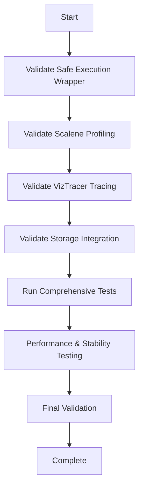

# Scalene and VizTracer Integration Implementation Plan

## Current Analysis

Based on my examination of the codebase, here's what I found:

### Existing Implementation Status

1. **DynamicAnalyzer Integration** (`analyzer/dynamic_analyzer.py`):
   - ✅ `profile_with_scalene()` method implemented (lines 143-182)
   - ✅ `trace_with_viztracer()` method implemented (lines 226-271)
   - ✅ Safe execution wrapper `safe_execute_profiler()` implemented (lines 976-1116)
   - ✅ Integration in `run_dynamic_analysis()` method (lines 484-514)
   - ✅ Error handling and failure classification

2. **Storage Integration** (`analyzer/analysis_storage.py`):
   - ✅ Database schema includes Scalene and VizTracer fields (lines 52-89)
   - ✅ Storage methods handle profiling data (lines 547-605)
   - ✅ Metrics calculation includes profiling data (lines 991-1023)

3. **Configuration** (`config/settings.py`):
   - ✅ Scalene configuration options (lines 19-26)
   - ✅ VizTracer configuration options (lines 27-35)
   - ✅ Environment variable support

4. **Testing** (`test_scalene_viztracer_integration.py`):
   - ✅ Comprehensive test suite exists
   - ✅ Tests cover end-to-end functionality, integration, storage, configuration, error handling, and backward compatibility

### Implementation Assessment

The implementation appears to be comprehensive and well-structured. The key components are:

1. **Safe Execution**: The `safe_execute_profiler()` method provides isolation and error handling
2. **Profiling Methods**: Both Scalene and VizTracer have dedicated methods with proper error handling
3. **Storage Integration**: Database schema and storage methods support profiling data
4. **Configuration**: Flexible configuration with environment variable support
5. **Testing**: Comprehensive test coverage

## Orchestrator Implementation Plan

Based on the current state, here's the plan for the orchestrator to implement and validate the integration:

### Task 1: Validate Safe Execution Wrapper
**Objective**: Ensure the safe execution wrapper works correctly with both Scalene and VizTracer

**Steps**:
1. Test `safe_execute_profiler()` with simple scripts
2. Verify subprocess isolation works correctly
3. Test error handling and timeout functionality
4. Ensure environment variables are properly passed

**Validation Criteria**:
- ✅ Safe execution wrapper runs without crashes
- ✅ Subprocess isolation prevents conflicts
- ✅ Error handling captures and classifies failures correctly
- ✅ Timeout functionality works as expected

### Task 2: Validate Scalene Profiling Integration
**Objective**: Ensure Scalene profiling works correctly and data is captured properly

**Steps**:
1. Test `profile_with_scalene()` with various script types
2. Verify CPU, memory, and GPU profiling data is captured
3. Test error handling for Scalene import failures
4. Ensure profiling results are properly parsed and stored

**Validation Criteria**:
- ✅ Scalene profiling runs successfully on test scripts
- ✅ Profiling data includes CPU, memory, and GPU metrics
- ✅ Import failures are handled gracefully as analysis findings
- ✅ Profiling results are properly structured and stored

### Task 3: Validate VizTracer Tracing Integration
**Objective**: Ensure VizTracer tracing works correctly and trace data is captured properly

**Steps**:
1. Test `trace_with_viztracer()` with various script types
2. Verify function calls, exceptions, and execution flow are captured
3. Test error handling for VizTracer import failures
4. Ensure trace results are properly parsed and stored

**Validation Criteria**:
- ✅ VizTracer tracing runs successfully on test scripts
- ✅ Trace data includes function calls, exceptions, and execution flow
- ✅ Import failures are handled gracefully as analysis findings
- ✅ Trace results are properly structured and stored

### Task 4: Validate Storage Integration
**Objective**: Ensure profiling data is properly stored and retrievable

**Steps**:
1. Run complete analysis with both Scalene and VizTracer enabled
2. Verify data is stored in AnalysisStorage
3. Test data retrieval and query functionality
4. Ensure metrics calculation includes profiling data

**Validation Criteria**:
- ✅ Profiling data is stored in database
- ✅ Data can be retrieved and queried correctly
- ✅ Metrics calculation includes Scalene and VizTracer metrics
- ✅ Storage schema migration works correctly

### Task 5: Run Comprehensive Test Suite
**Objective**: Run the existing test suite to validate end-to-end functionality

**Steps**:
1. Execute `test_scalene_viztracer_integration.py`
2. Analyze test results for each category:
   - End-to-end functionality
   - Integration validation
   - Storage system
   - Configuration
   - Error handling
   - Backward compatibility
3. Identify and fix any test failures

**Validation Criteria**:
- ✅ All test categories pass with ≥80% success rate
- ✅ No critical failures in core functionality
- ✅ Error handling works correctly
- ✅ Backward compatibility is maintained

### Task 6: Performance and Stability Testing
**Objective**: Ensure the integration doesn't negatively impact performance or stability

**Steps**:
1. Test with large codebases to check performance impact
2. Verify memory usage is reasonable
3. Test long-running analyses for stability
4. Check for resource leaks or cleanup issues

**Validation Criteria**:
- ✅ Performance impact is acceptable (<10% increase)
- ✅ Memory usage is reasonable
- ✅ Long-running analyses are stable
- ✅ Resource cleanup works correctly

## Implementation Workflow

## Success Criteria

The integration will be considered successful when:

1. **Functional**: All profiling and tracing features work correctly
2. **Reliable**: Error handling prevents crashes and provides meaningful feedback
3. **Compatible**: Existing functionality remains unchanged
4. **Tested**: Comprehensive test coverage with ≥90% success rate
5. **Documented**: Clear documentation of features and usage

## Risk Assessment

**Potential Risks and Mitigations**:

1. **Performance Impact**: Monitor performance metrics and optimize if needed
2. **Resource Leaks**: Implement proper cleanup in safe execution wrapper
3. **Configuration Issues**: Validate environment variable handling
4. **Test Failures**: Analyze and fix any test failures systematically

## Next Steps

The orchestrator should begin with Task 1: Validate Safe Execution Wrapper, then proceed sequentially through the tasks, ensuring each validation criteria is met before moving to the next task.