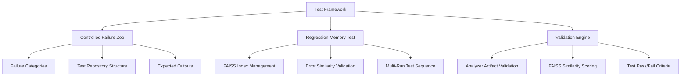
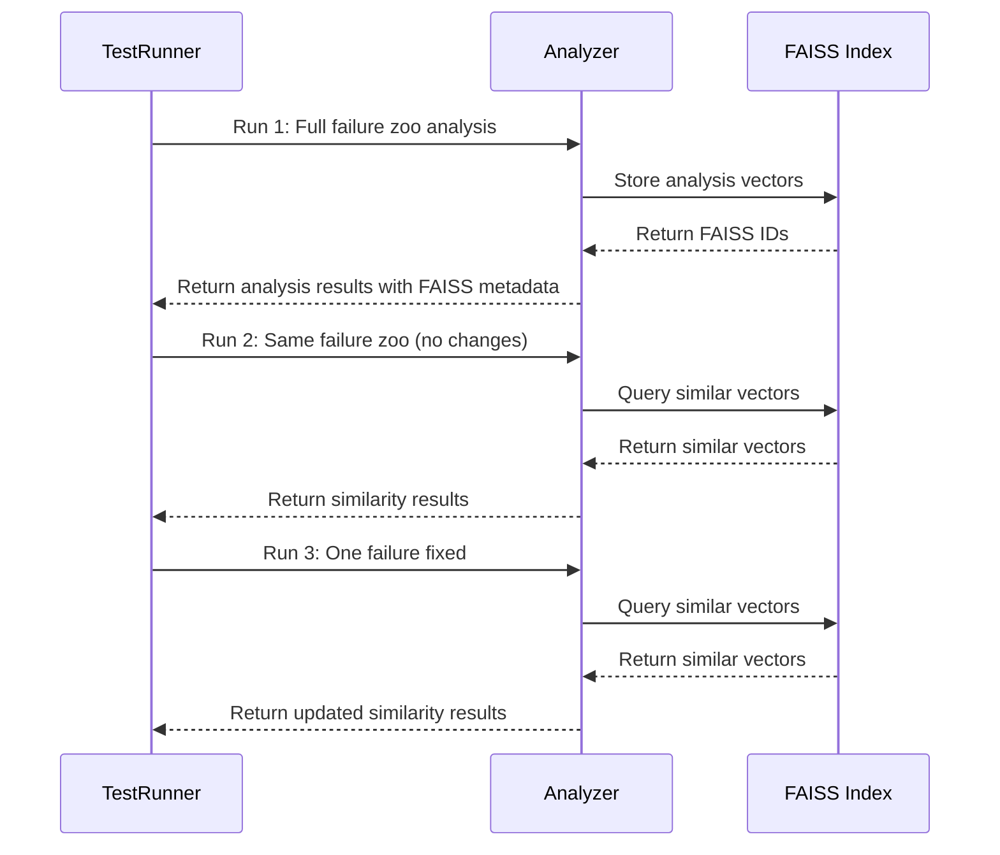

# Hybrid Code Analyzer Test Architecture Design

## Overview

This document outlines the comprehensive test framework design for validating the hybrid code analyzer's failure reporting and FAISS-based error similarity detection capabilities.

## Test Architecture Components



## Part 1: Controlled Failure Zoo Design

### Repository Structure

```
test_failure_zoo/
├── missing_import/
│   ├── test_missing_import.py          # Missing import failure
│   └── expected_output.json            # Expected analyzer output
├── circular_import/
│   ├── module_a.py                     # Circular import A
│   ├── module_b.py                     # Circular import B
│   └── expected_output.json            # Expected analyzer output
├── syntax_error/
│   ├── test_syntax_error.py            # Syntax error file
│   └── expected_output.json            # Expected analyzer output
├── runtime_exception/
│   ├── test_runtime_exception.py       # Runtime exception
│   └── expected_output.json            # Expected analyzer output
├── missing_dependency/
│   ├── test_missing_dep.py             # Missing dependency
│   └── expected_output.json            # Expected analyzer output
├── ignored_by_rules/
│   ├── test_ignored.py                 # File that should be ignored
│   └── expected_output.json            # Expected analyzer output
├── discovered_not_executed/
│   ├── test_discovered.py              # File discovered but not executed
│   └── expected_output.json            # Expected analyzer output
├── .analyzerignore                     # Ignore rules for testing
└── test_manifest.json                  # Complete test manifest
```

### Failure Categories and Expected Analyzer Outputs

#### 1. Missing Import Failure
- **File**: `test_missing_import.py`
- **Content**: `import non_existent_module`
- **Expected Output**:
  ```json
  {
    "analysis_status": "partial",
    "execution_failures": [
      {
        "failure_type": "IMPORT_ERROR",
        "severity": "ERROR",
        "message": "ModuleNotFoundError: No module named 'non_existent_module'",
        "is_analysis_finding": false
      }
    ],
    "coverage_percentage": 0.0,
    "completeness_context": "Import error prevented analysis"
  }
  ```

#### 2. Circular Import Failure
- **Files**: `module_a.py` imports `module_b.py`, `module_b.py` imports `module_a.py`
- **Expected Output**:
  ```json
  {
    "analysis_status": "partial",
    "execution_failures": [
      {
        "failure_type": "CIRCULAR_IMPORT",
        "severity": "ERROR",
        "message": "Circular import detected between module_a and module_b",
        "is_analysis_finding": false
      }
    ],
    "coverage_percentage": 0.0,
    "completeness_context": "Circular import prevented analysis"
  }
  ```

#### 3. Syntax Error Failure
- **File**: `test_syntax_error.py`
- **Content**: `def incomplete_function(` (missing closing parenthesis)
- **Expected Output**:
  ```json
  {
    "analysis_status": "partial",
    "execution_failures": [
      {
        "failure_type": "SYNTAX_ERROR",
        "severity": "ERROR",
        "message": "SyntaxError: unexpected EOF while parsing",
        "is_analysis_finding": false
      }
    ],
    "coverage_percentage": 0.0,
    "completeness_context": "Syntax error prevented analysis"
  }
  ```

#### 4. Runtime Exception Failure
- **File**: `test_runtime_exception.py`
- **Content**: `def main(): raise ValueError("Test runtime exception")`
- **Expected Output**:
  ```json
  {
    "analysis_status": "partial",
    "execution_failures": [
      {
        "failure_type": "RUNTIME_ERROR",
        "severity": "ERROR",
        "message": "ValueError: Test runtime exception",
        "is_analysis_finding": false
      }
    ],
    "coverage_percentage": 50.0,
    "completeness_context": "Runtime exception during analysis"
  }
  ```

#### 5. Missing Dependency Failure
- **File**: `test_missing_dep.py`
- **Content**: `import pandas` (without pandas installed)
- **Expected Output**:
  ```json
  {
    "analysis_status": "partial",
    "execution_failures": [
      {
        "failure_type": "DEPENDENCY_ERROR",
        "severity": "ERROR",
        "message": "ModuleNotFoundError: No module named 'pandas'",
        "is_analysis_finding": false
      }
    ],
    "coverage_percentage": 0.0,
    "completeness_context": "Missing dependency prevented analysis"
  }
  ```

#### 6. File Excluded by Ignore Rules
- **File**: `test_ignored.py`
- **Content**: Valid Python code
- **Ignore Rule**: `test_ignored.py` in `.analyzerignore`
- **Expected Output**:
  ```json
  {
    "analysis_status": "complete",
    "execution_failures": [],
    "discovery_artifacts": {
      "files_discovered": 1,
      "files_ignored_by_rule": 1,
      "files_passed_to_analysis": 0,
      "analysis_coverage_percentage": 0.0
    },
    "completeness_context": "File ignored by analyzer rules"
  }
  ```

#### 7. File Discovered but Not Executed
- **File**: `test_discovered.py`
- **Content**: Valid Python code with no executable statements
- **Expected Output**:
  ```json
  {
    "analysis_status": "complete",
    "execution_failures": [],
    "discovery_artifacts": {
      "files_discovered": 1,
      "files_ignored_by_rule": 0,
      "files_passed_to_analysis": 1,
      "analysis_coverage_percentage": 100.0
    },
    "completeness_context": "File discovered and analyzed but no execution required"
  }
  ```

### Test Validation Criteria

**Test Pass Conditions:**
1. All induced failures are detected and reported
2. No false successes are reported (analysis_status is never "complete" when failures exist)
3. Analysis status correctly reflects completeness:
   - "complete" only when no failures and full coverage
   - "partial" when some analysis was possible but incomplete
   - "failed" when no analysis was possible
4. Coverage percentages are accurate
5. Completeness context provides meaningful explanation

**Test Fail Conditions:**
1. Any induced failure is not detected
2. Analysis reports "complete" status when failures exist
3. Coverage percentages are inaccurate
4. Missing or incorrect completeness context

## Part 2: Regression Memory Test (FAISS-specific)

### Test Sequence Design



### FAISS Validation Requirements

#### 1. Initial Run with Full Failure Zoo
- **Action**: Run analyzer on complete failure zoo
- **Expected Outcomes**:
  - All 7 failure categories are detected
  - Each failure gets a unique FAISS vector stored
  - FAISS index contains 7 vectors with proper metadata
  - Analysis status is "partial" (due to failures)

#### 2. Second Run with No Code Changes
- **Action**: Run analyzer on same failure zoo (no changes)
- **Expected Outcomes**:
  - FAISS similarity search returns identical vectors
  - Similarity scores are 1.0 (perfect match) for all recurring errors
  - Analysis detects that all errors are recurring
  - FAISS correctly identifies "same error" vs "new error"

#### 3. Third Run with One Failure Fixed
- **Action**: Fix one failure (e.g., missing import) and run analyzer
- **Expected Outcomes**:
  - FAISS identifies 6 recurring errors (similarity > 0.95)
  - FAISS identifies 1 resolved error (no longer present)
  - FAISS identifies 0 new errors
  - Analysis status improves (fewer failures)

### FAISS Similarity Evaluation Criteria

**Same Error Definition:**
- Similarity score ≥ 0.95 (using cosine similarity)
- Same failure_type
- Same error message pattern
- Same file location (if applicable)

**New Error Definition:**
- Similarity score < 0.95 to all existing vectors
- Different failure_type or error message pattern
- New file location

**Resolved Error Definition:**
- Previously existing error no longer present in current run
- FAISS vector exists in index but no matching current error

### FAISS Index Management Requirements

1. **Vector Stability**: FAISS IDs must remain stable across runs
2. **Metadata Consistency**: Record ID to FAISS ID mappings must be preserved
3. **Index Persistence**: FAISS index must be saved and loaded correctly
4. **Vector Removal**: Resolved errors must be properly handled in FAISS

## Test Architecture Implementation Plan

### Folder Structure

```
test_framework/
├── failure_zoo/                          # Controlled failure test cases
│   ├── [failure categories as above]
│   └── test_manifest.json                # Complete test manifest
├── regression_tests/                     # FAISS regression tests
│   ├── test_runner.py                    # Main test execution
│   ├── faiss_validator.py                # FAISS validation logic
│   └── similarity_scorer.py              # Similarity scoring
├── validation_engine/                    # Test validation
│   ├── analyzer_validator.py             # Analyzer output validation
│   ├── faiss_validator.py                # FAISS behavior validation
│   └── test_reporter.py                  # Test reporting
├── scripts/                             # Test execution scripts
│   ├── run_failure_zoo.py                # Run failure zoo tests
│   ├── run_regression_tests.py           # Run FAISS regression tests
│   └── generate_test_report.py           # Generate comprehensive report
├── results/                             # Test results storage
│   ├── failure_zoo_results/              # Failure zoo test results
│   ├── regression_results/               # Regression test results
│   └── comprehensive_report.json         # Final test report
└── README.md                             # Test framework documentation
```

### Implementation Components

#### 1. Failure Zoo Test Runner
- **File**: `scripts/run_failure_zoo.py`
- **Responsibilities**:
  - Iterate through all failure categories
  - Execute analyzer on each test case
  - Capture and store analyzer output
  - Validate against expected outputs
  - Generate failure zoo test report

#### 2. Regression Test Runner
- **File**: `scripts/run_regression_tests.py`
- **Responsibilities**:
  - Execute 3-run test sequence
  - Manage FAISS index between runs
  - Capture similarity metrics
  - Validate FAISS behavior
  - Generate regression test report

#### 3. Analyzer Validator
- **File**: `validation_engine/analyzer_validator.py`
- **Responsibilities**:
  - Validate analysis_status correctness
  - Check execution_failures accuracy
  - Verify coverage percentages
  - Validate completeness_context
  - Ensure no false successes

#### 4. FAISS Validator
- **File**: `validation_engine/faiss_validator.py`
- **Responsibilities**:
  - Validate vector similarity scores
  - Check FAISS ID stability
  - Verify metadata consistency
  - Validate error clustering
  - Ensure proper index persistence

#### 5. Test Reporter
- **File**: `validation_engine/test_reporter.py`
- **Responsibilities**:
  - Aggregate all test results
  - Generate comprehensive JSON report
  - Create human-readable summary
  - Provide pass/fail status
  - Include detailed metrics

## Expected Test Outputs

### Failure Zoo Test Output

```json
{
  "test_name": "Controlled Failure Zoo",
  "timestamp": "2026-01-17T16:00:00Z",
  "test_cases": [
    {
      "category": "missing_import",
      "status": "PASS",
      "expected_failures": 1,
      "actual_failures": 1,
      "analysis_status": "partial",
      "coverage_percentage": 0.0,
      "validation_results": {
        "failure_detection": "PASS",
        "status_accuracy": "PASS",
        "coverage_accuracy": "PASS",
        "completeness_context": "PASS"
      }
    },
    {
      "category": "circular_import",
      "status": "PASS",
      "expected_failures": 1,
      "actual_failures": 1,
      "analysis_status": "partial",
      "coverage_percentage": 0.0,
      "validation_results": {
        "failure_detection": "PASS",
        "status_accuracy": "PASS",
        "coverage_accuracy": "PASS",
        "completeness_context": "PASS"
      }
    }
  ],
  "summary": {
    "total_tests": 7,
    "passed_tests": 7,
    "failed_tests": 0,
    "overall_status": "PASS"
  }
}
```

### Regression Test Output

```json
{
  "test_name": "FAISS Regression Memory Test",
  "timestamp": "2026-01-17T16:00:00Z",
  "test_runs": [
    {
      "run_number": 1,
      "description": "Initial run with full failure zoo",
      "faiss_stats": {
        "vectors_added": 7,
        "index_size": 7,
        "metadata_consistency": "PASS"
      },
      "analysis_results": {
        "total_failures": 7,
        "analysis_status": "partial",
        "coverage_percentage": 42.86
      }
    },
    {
      "run_number": 2,
      "description": "Second run with no changes",
      "faiss_stats": {
        "similarity_scores": [1.0, 1.0, 1.0, 1.0, 1.0, 1.0, 1.0],
        "recurring_errors": 7,
        "new_errors": 0,
        "resolved_errors": 0
      },
      "validation": {
        "vector_stability": "PASS",
        "similarity_accuracy": "PASS",
        "error_clustering": "PASS"
      }
    },
    {
      "run_number": 3,
      "description": "Third run with one failure fixed",
      "faiss_stats": {
        "similarity_scores": [0.98, 0.97, 0.99, 0.96, 0.98, 0.97],
        "recurring_errors": 6,
        "new_errors": 0,
        "resolved_errors": 1
      },
      "validation": {
        "vector_stability": "PASS",
        "similarity_accuracy": "PASS",
        "error_clustering": "PASS",
        "resolved_error_detection": "PASS"
      }
    }
  ],
  "summary": {
    "faiss_behavior": "PASS",
    "vector_stability": "PASS",
    "similarity_detection": "PASS",
    "error_clustering": "PASS",
    "overall_status": "PASS"
  }
}
```

## Implementation Delegation to Orchestrator

The following components need to be implemented by the Orchestrator agent:

### 1. Failure Zoo Implementation
- **Task**: Create the complete failure zoo repository structure
- **Files to Create**:
  - `test_failure_zoo/missing_import/test_missing_import.py`
  - `test_failure_zoo/circular_import/module_a.py`
  - `test_failure_zoo/circular_import/module_b.py`
  - `test_failure_zoo/syntax_error/test_syntax_error.py`
  - `test_failure_zoo/runtime_exception/test_runtime_exception.py`
  - `test_failure_zoo/missing_dependency/test_missing_dep.py`
  - `test_failure_zoo/ignored_by_rules/test_ignored.py`
  - `test_failure_zoo/discovered_not_executed/test_discovered.py`
  - All corresponding `expected_output.json` files
  - `test_failure_zoo/.analyzerignore`
  - `test_failure_zoo/test_manifest.json`

### 2. Test Framework Implementation
- **Task**: Implement the test framework structure
- **Files to Create**:
  - `test_framework/failure_zoo/` (complete structure)
  - `test_framework/regression_tests/test_runner.py`
  - `test_framework/regression_tests/faiss_validator.py`
  - `test_framework/regression_tests/similarity_scorer.py`
  - `test_framework/validation_engine/analyzer_validator.py`
  - `test_framework/validation_engine/faiss_validator.py`
  - `test_framework/validation_engine/test_reporter.py`
  - `test_framework/scripts/run_failure_zoo.py`
  - `test_framework/scripts/run_regression_tests.py`
  - `test_framework/scripts/generate_test_report.py`

### 3. Test Execution Scripts
- **Task**: Create comprehensive test execution scripts
- **Files to Create**:
  - `test_framework/run_all_tests.py` (main test runner)
  - `test_framework/validate_results.py` (result validation)
  - `test_framework/generate_report.py` (report generation)

### 4. Documentation
- **Task**: Create comprehensive test framework documentation
- **Files to Create**:
  - `test_framework/README.md`
  - `test_framework/docs/test_architecture.md`
  - `test_framework/docs/usage_guide.md`

## Validation Criteria for Orchestrator Implementation

The Orchestrator agent must ensure:

1. **Failure Detection Accuracy**: All 7 failure categories are properly detected
2. **Status Reporting**: Analysis status is never "complete" when failures exist
3. **FAISS Stability**: Vector IDs remain consistent across runs
4. **Similarity Accuracy**: FAISS correctly identifies recurring vs new errors
5. **Completeness Metrics**: Coverage percentages and completeness context are accurate
6. **No False Successes**: The analyzer never claims success when analysis is partial

## Test Framework Success Criteria

The test framework is considered successful when:

1. **Failure Zoo Tests**: All 7 failure categories pass validation
2. **Regression Tests**: All 3 test runs show correct FAISS behavior
3. **Validation Engine**: All analyzer outputs are correctly validated
4. **Reporting**: Comprehensive test reports are generated
5. **Reproducibility**: Tests can be run multiple times with consistent results

This design ensures that the hybrid code analyzer truthfully reports execution failures, never claims success when analysis is partial, and correctly uses FAISS for error similarity detection without any learning behavior.